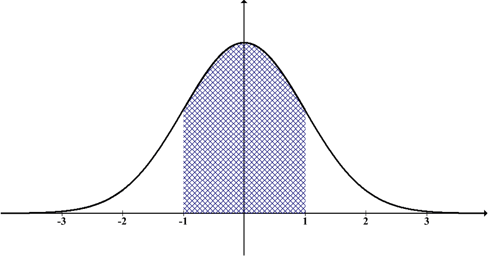

# De numeros aleatorios, distribuciones y probabilidades

<style> body {text-align: justify} </style> <!-- Justify text. -->

En R, existen funciones para la generacion de numeros aleatorios, es decir, podremos generar cualquier numero de 0 a infinito de forma automatica. Para esto, debemos especificar la distribucion de probabilidad de la cual queremos obtener estos numeros aleatorios.

Una distribucion de probabilidad describe la gama de resultados que podemos obtener. De esta manera, la probabilidad de que obtengamos un valor dependera de la distribucion de probabilidad.

**Ejemplo:**

**La probabilidad de los dados:**

<p>&nbsp;</p>
```{r dice, echo=FALSE, out.width = '100%'}

```
<p>&nbsp;</p>

Un dado convencional se caracteriza por poseer 6 lados, y cada lado representa un valor de 1 al 6. Frecuentemente en juegos de mesa como el parques, mientras mas alto sea el numero, mas podremos avanzar y ganar. Al lanzar el dado para poder avanzar, existe una probabilidad fija de obtener cualquiera de los 6 lados. Ya que esta probabilidad es la misma para cada lado (1/6), podriamos decir que la distribucion de los numeros de un dado pertenece a la distribucion uniforme.

## Distribucion uniforme:

En nuestro ejemplo del dado, planteamos que la distribucion de los numeros de cada lado del dado tiene una distribucion uniforme, debido a que la probabilidad de de obtener cada lado es la misma. Vamos a explorar un poco esto en R.

Para obtener un numero aleatorio n que viene de una distribucion uniforme utilizamos runif()

__*Estructura de la funcion*__

*runif(n, min, max)*

###### Para maas informacion ejecute ?runif

Vamos a escoger 10 numeros aleatorios del 1 al 6 que vienen de una distribucion uniforme

```{r}
ru1 <- runif(n = 10, min = 1, max = 6) #los numeros que obtendremos tienen decimales
hist(ru1)
```

Segun nuestro histograma, y dependiendo de los numeros que nos toque, puede que obtengamos mas veces un numero que otro, ¿entonces la probabilidad no es la misma?

```{r}
ru2 <- runif(n =100, min = 1, max = 6) 
hist(ru2)
```

```{r}
ru3 <- runif(n =1000, min = 1, max = 6) 
hist(ru3)
```

¡Ahora nuestro histograma parece mas uniforme!. Cuando trabajamos con datos, siempre es una buena practica tener una muestra grande, con esto evitamos el sesgo en nuestros analisis.

## Distribucion normal:

La distribucion normal es una de las más importantes, ya que se ajusta a muchos datos que representan procesos en la vida real. Su representacion se asemeja a la de una campana, la campana de Gauss.

```{r camp, echo=FALSE, out.width = '100%'}

```

Para obtener un numero aleatorio n que viene de una distribuion normal utilizamos rnorm()

__*Estructura de la funcion*__

*rnorm(n, mean, sd)*

###### Para maas informacion ejecute ?rnorm

```{r}
rnorm(n = 4, mean = 100, sd = 5)
```

######?set.seed para reproducir los mismos numeros

```{r}
set.seed(6)
rnorm(n = 10, mean = 5, sd = 5)
```

```{r}
set.seed(6)
rnorm(n = 10, mean = 5, sd = 5)
```

```{r}
set.seed(4)
rnorm(n = 10, mean = 5, sd = 5)
```

**Distribucion normal estandar**

```{r}
rnorm(n = 100)
```

Distribucion normal con media de 5 y distribucion estandar de 2
```{r}
rn<-rnorm(n = 100, mean = 5, sd = 2)
hist(rn)
mean(rn)
sd(rn)
```

Distribucion normal con media de 5 y distribucion estandar de 2
Aumente n: 1000, 10000, 100000

```{r}
r<-rnorm(1000000, mean=5, sd=2)
hist(r)
mean(r)
sd(r)
```

**Ejemplo:**

Vamos a cargar un conjunto de datos que contiene dos medidas del sepalo y petalo de diferentes especies de flores

```{r}
data(iris)
hist(iris$Sepal.Length)
hist(iris$Sepal.Width)
hist(iris$Petal.Length)
hist(iris$Petal.Width)
```

¿Cual dato representa mejor una distribucion normal?

### Ggplot

library(ggplot2)

```{r}
library(ggplot2)
ggplot(iris, aes(Sepal.Width)) +
  geom_bar(stat = "count")
```

**Ejercicios:**

**1.** Cree un vector v1 que contenga una muestra de 1000 numeros aleatorios que vengan de una distribucion normal con media de 112 y desviacion estandar  de 35. Grafique los valores en un histograma

**2.** Cree un vector v2 que contenga una muestra de 1000 numeros aleatorios que vengan de una distribucion normal con media de 34 y desviacion estandar de 3. Grafique los valores en un histograma

**3.** Multiplique v1 con v2 y grafique el resutado en un histograma. ¿Cual es la diferencia de este histograma con los anteriores?

**4.** Cree un vector "x" que contenga 14 numeros entre 1 y 50 que vengan de una distribucion uniforme. Cree otro vector "y" que contenga los valores de "x" pero dos veces mas grande. Suma a cada valor de "y" un valor constante de 7. Ahora grafiquelo mostrando "y" sobre "x" : plot(x,y)

## Probabilidad en distribución nomral

Para calcular la probabilidad de obtener un valor que viene de una distribucion normal, utilizamos la funcion pnorm()

__*Estructura de la funcion*__

*pnorm(q, mean, sd)*

###### Para maas informacion ejecute ?pnorm

¿Cual es la probabilidad de obtener un valor menor que -2 que venga de la distribucion normal? (mean = 2, sd = 2)?

```{r}
pnorm(q = 9, mean = 2, sd = 2)
```

¿Cual es la probabilidad de obtener un valor mayor que -2 que venga de la distribucion normal mencionada anteriormente (mean = 2, sd = 2)?

```{r}
1-pnorm(-2,mean=2,sd=2)
```

## Mas ejercicios

¿Cual es la probabilidad de obtener un valor menor que 5 que venga de la distribucion normal mencionada anteriormente (mean = 5, sd = 2)?

¿Cual es la probabilidad de obtener un valor entre 2 y 8?


