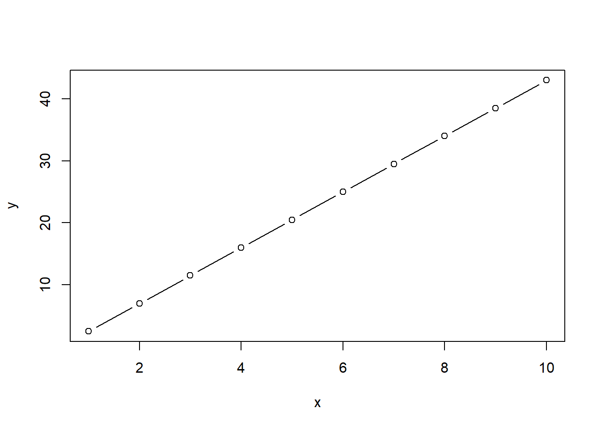
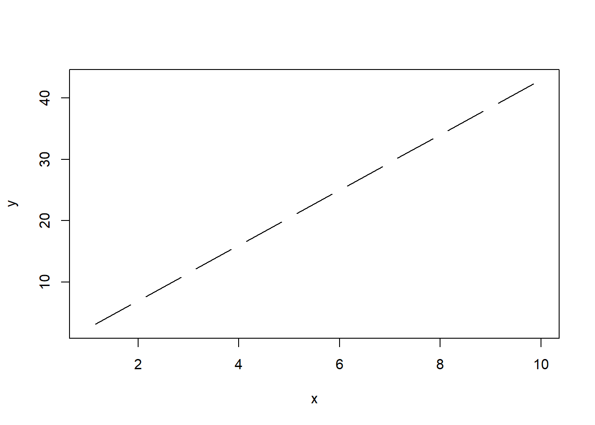

# Gráficas en R 

En esta sesión vamos a explorar las herramientas en R para realizar gráficas a partir de datos, y los diferentes elementos que permiten modificar una gráfica para personalizarla

## Gráficas y diagrama de dispersión simple 

### Diagrama de dispersión: función plot()

Comenzamos creando algunos datos a graficar:


```r
x <- 1:10
y <- 1.5 * x + seq(from = 1, to = 30,  by = 3) # 
```

El diagrama de dispersión puede ser escrito de dos formas:


```r
plot(x, y)
```


```r
plot(y~x)
```


Con type es posible cambiar la disposición del diagrama de dispersión:


```r
plot(x, y, type="l")
```


```r
plot(x, y, type="b")
```



```r
plot(x, y, type="c")
```



```r
plot(x, y, type="o")
```


```r
plot(x, y, type="h")
```


```r
plot(x, y, type="n")
```


### Etiquetas de la gráfica: xlab, ylab, main


```r
plot(x, y, xlab = "eje x", ylab = "eje y", main = "Titulo del grafico", type = "n")
points(x , y, col = "red", pch = 19)
lines(x, y, col = "blue")
```


¿Qué ocurre aquí? Por favor explique:


```r
plot(x, y, xlab = "eje x", ylab = "eje y", main = "Titulo del grafico", type = "n")
points(x + 0.5, y, col = "blue", pch = 15, cex = 5.5) 
```


¿Para que son los argumentos "pch" y "cex"?

?points

**Ejercicios:**
```
1. Haga una linea en zigzag con puntos de colores en los puntos de giro

2. Haga una carita (:|)
```

Más gráficas: {-}


```r
x <- seq(from = 0, to = 2 * pi, by = 0.2)
y <- sin(x) # Función seno
plot(x, y)

z <- cos(x) #Función coseno
lines(x, z)  # Agregamos líneas al grafico anterior 
points(x, z * 0.5, pch = 16) # Agregamos puntos al gráfico anterior 
```


```r
#De nuevo, eje, etiquetas y título 
plot(x, y, xlab = "eje x", type = "l", ylab = "eje y", main = "Curva sinusoidal")
```


```r
#Cambiando la extension de los ejes "x" y "y" usando "xlim" y "ylim"

plot(x, y, xlab = "eje x", type = "l", ylab = "eje y", main = "Curva sinusoidal", 
     xlim = c(-1, 7), ylim = c(-2, 2))
```


```r
plot(x, y, xlab = "eje x", type = "l", ylab = "eje y", main = "Curva sinusoidal", 
     xlim = c(2, 4), ylim = c(0, 1))
```


##  Demostración de la versatilidad de la gráfica            

La representación gráfica en R es muy flexible. Vamos a cambiar mas parametros gráficos:

 - 'cex': escala de simbolos (tamano)


```r
plot(x, y, cex = rep(1:8, times = 4))
```


 - 'pch': cambia el simbolo de los puntos


```r
plot(1:25, 1:25, cex = 2, pch = 1:25)
```


 - 'col': colores de los puntos. En R estan disponibles mas de 600 colores 


```r
a <- rep(1:55, times = 10); b <- rep(1:10, each = 55)
plot(a, b, pch = 19, cex = 2, col = colors()[-c(260:361, 653:657)])
```


Los gradientes de colores tambien son posibles: ?rainbow


```r
plot(1:100, 1:100, pch = 19, cex = 3, col = rainbow(100))
```


Para los simbolos 21 a 25 de los puntos (ver ?points) puede tener diferentes colores de relleno


```r
plot (1:25, cex=2, pch=1:25, col="blue", bg="red")
```


**Ejercicios:**
```
1. Consulte la pagina web de Quick-R para ver ejemplos de diagramas de dispersion (http://www.statmethods.net/graphs/scatterplot.html) y elija uno que explique a sus colegas.
```

## Barras, cajas e histogramas

Algunas de las gráficas más populares para reportar y explorar datos es mediante las graficas de barras (conteo de observaciones), cajas (estadisticos de nuestros datos) e histogramas (frecuencia de valores)

En R, estas gráficas se realizan meidante las siguientes funciones:

?barplot()
?boxplot()
?hist()

Vamos a explorar estas funciones. 

Si queremos ver el número de registros de nuestras variables, podemos hacerlo mediante una gráfica de barras. Para poder graficarlo, necesitamos un vector o matriz que conenga valores numéricos.


```r
x <- c(100,20,70,240,230)

barplot(x)
```


```r
barplot(x, names.arg = c("x1", "x2", "x3", "x4", "x5")) #Asignamos nombres a cada barra
```


```r
barplot(x, names.arg = c("x1", "x2", "x3", "x4", "x5"), horiz = TRUE) #Podemos invertir los ejes
```


```r
barplot(x, names.arg = c("x1", "x2", "x3", "x4", "x5"), ylim = c(0,100)) #Podemos limitar el valor de los ejes
```


Realice la misma gráfica anterior pero con colores, nombres en los ejes y título.

Mediante boxplot podemos hacer gráficos sencillos que nos muestren datos estadísticos de nuestros datos


```r
data(iris)
```

Cargamos un set de datos predeterminado en R y observamos su contenido.

El set de datos iris se trata de medidas del sépalo y pétalo de distintas especies de plantas.


```r
boxplot(iris$Sepal.Length) # En este boxplot podemos ver la mediana (linea negra central), los cuatiles 1 y 3 (area gris) y los valores atípicos o outliers (lineas extremas) de los valores de longitud del sepalo de todas las especies 
```


```r
boxplot(Petal.Length ~ Species, data = iris) #Podemos graficar los estadisticos para cada grupo usando el simbolo "~"
```


¿Qué pasa si invertimos las variables?

```
boxplot(Species ~ Petal.Length, data = iris)
```

Finalmente, mediante el gráfico de histograma podemos explorar frecuencias de valores.


```r
hist(iris$Sepal.Length) # En el grafico, el observamos la frecuencia (eje y) y el rango de valores que toma la variable (eje x)
```


```r
hist(iris$Petal.Width, col = "yellow")
```


Explore los diferentes argumentos dentro de cada función.

## Función par()

Mediante la función par() podemos ajustar distintos parametros de nuestra gráfica, asi como mostrar mas de una gráfica al tiempo, colores, texto y muchas otras características

?par


```r
opar <- par() #Antes de empezar a utilizar par, guardamos la configuración por defecto en un vector para reestablecer su configuracion por defecto

dev.off() #O podemos cerrar los plots creados anteriormente para reestablecer la configuración
- null device 
-           1
dat_dias <- data.frame(
  dias = c("lunes", "martes", "miercoles", "jueves", "viernes"), 
  ganancias = c(20,35,40,10,27))
```

Realizaremos dos gráficas al tiempo mediante el argumento mfrow


```r
par(mfrow = c(1,2))
barplot(dat_dias$ganancias, main = "Barras", names.arg = dat_dias$dias)
pie(dat_dias$ganancias, labels = dat_dias$dias, main = "Torta", clockwise = T)
```


Utilice el argumento bg para cambiar el color de fondo del siguiente plot


```r
plot(x = c(1:10), y = c(11:20))

par(mfrow = c(1,1), bg = "green")
plot(x = c(1:10), y = c(11:20))
```


Mediante bty podemos cambiar la forma de la caja del plot:


```r
par(mfrow = c(1,1), bg = "white", bty = "l") #Pruebe cambiando "l" por o,7,c,u,],n
plot(x = c(1:10), y = c(11:20))
```


Podemos agregar colores a los diferentes elementos del gráfico


```r
par(mfrow = c(1,1), bg = "white", col.axis = "blue", col.lab = "green", col.main = "red", fg = "yellow") 
plot(x = c(1:10), y = c(11:20), main = "Dispersion")
```


Para cambiar la fuente del texto:

 - font.axis = valor numérico
 - font.lab
 - font.main
 - font.sub

Explore los siguientes argumentos disponibles en par(), explique su función y utilícelas en una gráfica

 - las
 - lty
 - lwd
 - fig
 - mai
 - pin
 - new


```r
par(mfrow = c(1,1), bg = "white", las = 3, lty = 3, lwd = 5, pin = c(1,2)) 
plot(x = c(1:10), y = c(11:20), main = "Dispersión")
```


### Gráficos compuestos

Usando algunas de las funciones anteriores, podemos ajustar varias figuras en un plot


```r
datos_aleatorios <- runif(100)

par(cex=0.7, mai=c(0.1,0.1,0.2,0.1), fig=c(0.1,0.7,0.3,0.9))
hist(datos_aleatorios) # Configuramos el tamaño de nuestro histograma y lo graficamos

par(fig=c(0.8,1,0,1), new=TRUE) # Configuramos la posición de un boxplot y agregamos new para que no limpie el gráfico anterior
boxplot(datos_aleatorios)

par(fig=c(0.1,0.67,0.1,0.25), new=TRUE)
plot(x = datos_aleatorios, y = datos_aleatorios + 10) # Y añadimos un gráfico de dispersion de otro set de datos
```


