# TidyR

En esta sesión vamos a explorar los datos de la sesión pasada de una manera diferente. Para esto vamos a cargar el conjunto de paquetes Tidyverse:

```
install.packages("tidiverse")
library(tidyverse)
```


Los paquetes que ofrece Tidyverse estan orientados en facilitar la manipulacion, importación, exploración y visualización de datos, permitiendo que el proceso sea eficiente y que los scripts puedan ser reproducibles entre usuarios. En esta sesión vamos a trabajar principalmente con dos paquetes, dplyr y ggplot, y algunas generalidades de otros paquetes para trabajar con datos tidy.

Los datos "tidy" se caracterizan por las siguientes tres características:

 * Cada columna es una variable
 * Cada fila es una observación
 * Cada elda es un valor único

Estas 3 características las veremos con frecuencia a lo largo de esta sesión.

***

##  Readr        

El paquete Readr es una alternativa para leer datos rectangulares como un ,csv. Las principales ventajas de usar readr para leer un csv son la velocidad con la que se importan los datos y el "parse" realizado sobre los datos. Esto ultimo quiere decir que la funcóon analizará automaticamente el tipo de dato que esta siendo importando y no podruce cambios inesperados. Con frecuencia, la función base de R puede convertir vectores de caracteres a factores. Además, readr lee automaticamente formatos de fechas.


```r
setwd("~/r tic/sesion 2")
dat <- read_csv("Santander_BIO_data.csv") #Leemos los datos y en la salida nos muestra las columnas y el tipo de dato que contiene cada variable
- Parsed with column specification:
- cols(
-   species = col_character(),
-   locality = col_character(),
-   municipio = col_character(),
-   kingdom = col_character(),
-   phylum = col_character(),
-   class = col_character(),
-   order = col_character(),
-   family = col_character(),
-   genus = col_character(),
-   taxonRank = col_character(),
-   elevation = col_double()
- )
```

Recordemos que nuestro data frame se trata de información sobre inventarios de la biodiversidad en el marco del proyecto Santander BIO. Nuestro data frame cuenta con información taxonomica (Nombre de la especie, familia, reino, etc) e información sobre los sitios y la altura a la que se encuentran estas especies.

Podemos cambiar el tipo de dato al importarlo, por ejemplo convertir algunas variables en factores


```r
setwd("~/r tic/sesion 2")
dat <- read_csv("Santander_BIO_data.csv", col_types = 
                  list(
                    species = col_character(),
                    locality = col_factor(),
                    municipio = col_factor(),
                    kingdom = col_factor(),
                    phylum = col_character(),
                    class = col_character(),
                    order = col_character(),
                    family = col_character(),
                    genus = col_character(),
                    taxonRank = col_character(),
                    elevation = col_double()
                  )
)
```

***

##  Tibble                                      

Tibble es una forma moderna de data.frame que ha provado ser mas efectiva. Los tibbles no cambian los nombres de las variables o el tipo de dato, y se quejan "mas" que un data.frame convencional.


```r
class(dat) #Si miramos que clase de vector son los objetivos cargados con readr, nos damos cuenta que estos son un tipo de tibble. Por esto, no hace sentido convertir un objeto cargado con readr a un tibble, pero si podemos convertir un data.frame convencional en un tibble.
- [1] "spec_tbl_df" "tbl_df"      "tbl"         "data.frame"
setwd("~/r tic/sesion 2")
dat_conv <-read.csv("Santander_BIO_data.csv")

class(dat_conv)
- [1] "data.frame"
dat_tibble <- as_tibble(dat_conv)

class(dat_tibble)
- [1] "tbl_df"     "tbl"        "data.frame"
```

Hay dos diferencias entre un tibble y un data.frame convencional: el método de impresión o print() y la forma de obtener subconjuntos.


```r
dat_tibble #Tibble nos muestra hasta 10 observaciones para mantener la consola menos saturada. En caso de necesitar mas de 10 observaciones, puede indicarlo de la siguiente manera
- # A tibble: 1,255 x 11
-    species locality municipio kingdom phylum class order family genus taxonRank
-    <chr>   <chr>    <chr>     <chr>   <chr>  <chr> <chr> <chr>  <chr> <chr>    
-  1 Acioti~ Vereda ~ Cimitarra Plantae Trach~ Magn~ Myrt~ Melas~ Acio~ SPECIES  
-  2 Adiant~ Vereda ~ Cimitarra Plantae Trach~ Poly~ Poly~ Pteri~ Adia~ SPECIES  
-  3 Adiant~ Vereda ~ Cimitarra Plantae Trach~ Poly~ Poly~ Pteri~ Adia~ SPECIES  
-  4 Adiant~ Vereda ~ Cimitarra Plantae Trach~ Poly~ Poly~ Pteri~ Adia~ SPECIES  
-  5 Aechme~ Vereda ~ Cimitarra Plantae Trach~ Lili~ Poal~ Brome~ Aech~ SPECIES  
-  6 Aegiph~ Vereda ~ Cimitarra Plantae Trach~ Magn~ Lami~ Lamia~ Aegi~ SPECIES  
-  7 Aegiph~ Vereda ~ Cimitarra Plantae Trach~ Magn~ Lami~ Lamia~ Aegi~ SPECIES  
-  8 Alloba~ Vereda ~ Cimitarra Animal~ Chord~ Amph~ Anura Aromo~ Allo~ SPECIES  
-  9 Amaiou~ Vereda ~ Cimitarra Plantae Trach~ Magn~ Gent~ Rubia~ Amai~ SPECIES  
- 10 Andino~ Vereda ~ Cimitarra Animal~ Chord~ Acti~ Perc~ Cichl~ Andi~ SPECIES  
- # ... with 1,245 more rows, and 1 more variable: elevation <int>
dat_tibble %>% print(n = 20)
- # A tibble: 1,255 x 11
-    species locality municipio kingdom phylum class order family genus taxonRank
-    <chr>   <chr>    <chr>     <chr>   <chr>  <chr> <chr> <chr>  <chr> <chr>    
-  1 Acioti~ Vereda ~ Cimitarra Plantae Trach~ Magn~ Myrt~ Melas~ Acio~ SPECIES  
-  2 Adiant~ Vereda ~ Cimitarra Plantae Trach~ Poly~ Poly~ Pteri~ Adia~ SPECIES  
-  3 Adiant~ Vereda ~ Cimitarra Plantae Trach~ Poly~ Poly~ Pteri~ Adia~ SPECIES  
-  4 Adiant~ Vereda ~ Cimitarra Plantae Trach~ Poly~ Poly~ Pteri~ Adia~ SPECIES  
-  5 Aechme~ Vereda ~ Cimitarra Plantae Trach~ Lili~ Poal~ Brome~ Aech~ SPECIES  
-  6 Aegiph~ Vereda ~ Cimitarra Plantae Trach~ Magn~ Lami~ Lamia~ Aegi~ SPECIES  
-  7 Aegiph~ Vereda ~ Cimitarra Plantae Trach~ Magn~ Lami~ Lamia~ Aegi~ SPECIES  
-  8 Alloba~ Vereda ~ Cimitarra Animal~ Chord~ Amph~ Anura Aromo~ Allo~ SPECIES  
-  9 Amaiou~ Vereda ~ Cimitarra Plantae Trach~ Magn~ Gent~ Rubia~ Amai~ SPECIES  
- 10 Andino~ Vereda ~ Cimitarra Animal~ Chord~ Acti~ Perc~ Cichl~ Andi~ SPECIES  
- 11 Annona~ Vereda ~ Cimitarra Plantae Trach~ Magn~ Magn~ Annon~ Anno~ SPECIES  
- 12 Annona~ Vereda ~ Cimitarra Plantae Trach~ Magn~ Magn~ Annon~ Anno~ SPECIES  
- 13 Anolis~ Vereda ~ Cimitarra Animal~ Chord~ Rept~ Squa~ Dacty~ Anol~ SPECIES  
- 14 Anolis~ Vereda ~ Cimitarra Animal~ Chord~ Rept~ Squa~ Dacty~ Anol~ SPECIES  
- 15 Apeiba~ Vereda ~ Cimitarra Plantae Trach~ Magn~ Malv~ Malva~ Apei~ SPECIES  
- 16 Aptero~ Vereda ~ Cimitarra Animal~ Chord~ Acti~ Gymn~ Apter~ Apte~ SPECIES  
- 17 Astyan~ Vereda ~ Cimitarra Animal~ Chord~ Acti~ Char~ Chara~ Asty~ SPECIES  
- 18 Bactri~ Vereda ~ Cimitarra Plantae Trach~ Lili~ Arec~ Areca~ Bact~ SPECIES  
- 19 Basili~ Vereda ~ Cimitarra Animal~ Chord~ Rept~ Squa~ Coryt~ Basi~ SPECIES  
- 20 Boana ~ Vereda ~ Cimitarra Animal~ Chord~ Amph~ Anura Hylid~ Boana SPECIES  
- # ... with 1,235 more rows, and 1 more variable: elevation <int>
```

Extraer datos de un tibble se hace de una manera mas estricta, ya que estos no realizan coincidencia parcial. Necesitaras escribir el nombre completo de la variable


```r
dat_conv$lo[1:5] #De forma convencional, al escribir el nombre incompleto de una variable, este mostrará la variable con el que mejor coincida
- [1] "Vereda El Aguila" "Vereda El Aguila" "Vereda El Aguila" "Vereda El Aguila"
- [5] "Vereda El Aguila"
dat_tibble$lo #Mientras que en tibble saltara un error
- Warning: Unknown or uninitialised column: `lo`.
- NULL
dat$lo #Lo mismo sucederá con readr
- Warning: Unknown or uninitialised column: `lo`.
- NULL
```

Finalmente, usted puede crear tibbles fila por fila o por columnas


```r
tibble(x = 1:5, y = 1, z = x ^ 2 + y) #Por columnas
- # A tibble: 5 x 3
-       x     y     z
-   <int> <dbl> <dbl>
- 1     1     1     2
- 2     2     1     5
- 3     3     1    10
- 4     4     1    17
- 5     5     1    26
tribble( #Por fila
  ~x, ~y,  ~z,
  "a", 2,  3.6,
  "b", 1,  8.5
)
- # A tibble: 2 x 3
-   x         y     z
-   <chr> <dbl> <dbl>
- 1 a         2   3.6
- 2 b         1   8.5
```

***

## Dplyr                                    

Dplyr es uno de los paquetes más utiles para la manipulación de datos. Dentro de sus funciones más utiles se encuentran:

 + mutate() Añade nuevas variables en función de variables existentes
 + select() Selecciona variables de acuerdo a su nombre
 + filter() Selcciona observaciones de acuerdo a sus valores
 + summarise() Resume cada grupo en menos filas
 + arrange() Cambia el orden de las observaciones

La forma simple para seleccionar una variable utilizada en la sesión anterior es mediante el símbolo $


```r
dat$species
-    [1] "Aciotis circaeifolia"           "Adiantum obliquum"             
-    [3] "Adiantum pulverulentum"         "Adiantum wilsonii"             
-    [5] "Aechmea longicuspis"            "Aegiphila cordata"             
-    [7] "Aegiphila panamensis"           "Allobates niputidea"           
-    [9] "Amaioua guianensis"             "Andinoacara latifrons"         
-   [11] "Annona glabra"                  "Annona mucosa"                 
-   [13] "Anolis auratus"                 "Anolis tropidogaster"          
-   [15] "Apeiba tibourbou"               "Apteronotus milesi"            
-   [17] "Astyanax fasciatus"             "Bactris pilosa"                
-   [19] "Basiliscus galeritus"           "Boana pugnax"                  
-   [21] "Bothrops asper"                 "Brachyhypopomus occidentalis"  
-   [23] "Bunocephalus colombianus"       "Byrsonima spicata"             
-   [25] "Canthidium haroldi"             "Canthon cyanellus"             
-   [27] "Canthon juvencus"               "Canthon mutabilis"             
-   [29] "Canthon septemmaculatus"        "Canthon subhyalinus"           
-   [31] "Capparidastrum grandiflorum"    "Cayaponia prunifera"           
-   [33] "Celtis iguanaea"                "Centrolobium paraense"         
-   [35] "Chondrodendron tomentosum"      "Clusia hammeliana"             
-   [37] "Codonanthopsis uleana"          "Compsoneura mutisii"           
-   [39] "Compsoneura sprucei"            "Coprophanaeus corythus"        
-   [41] "Costus spiralis"                "Couma macrocarpa"              
-   [43] "Coutarea hexandra"              "Craugastor metriosistus"       
-   [45] "Creagrutus affinis"             "Croton schiedeanus"            
-   [47] "Cupania latifolia"              "Cupania scrobiculata"          
-   [49] "Dasyloricaria filamentosa"      "Deltochilum guildingii"        
-   [51] "Deltochilum longiceps"          "Deltochilum molanoi"           
-   [53] "Dendrobates truncatus"          "Dendropanax arboreus"          
-   [55] "Dendropsophus microcephalus"    "Dichapetalum rugosum"          
-   [57] "Dichotomius andresi"            "Dieffenbachia parlatorei"      
-   [59] "Dioscorea marginata"            "Duguetia vallicola"            
-   [61] "Engystomops pustulosus"         "Ephedranthus columbianus"      
-   [63] "Erythrolamprus melanotus"       "Eschweilera coriacea"          
-   [65] "Eurysternus foedus"             "Eurysternus mexicanus"         
-   [67] "Eurysternus plebejus"           "Euterpe oleracea"              
-   [69] "Faramea capillipes"             "Faramea occidentalis"          
-   [71] "Ficus obtusifolia"              "Floscopa peruviana"            
-   [73] "Fridericia patellifera"         "Gasteropelecus maculatus"      
-   [75] "Geonoma congesta"               "Geophagus steindachneri"       
-   [77] "Gephyrocharax melanocheir"      "Gloxiniopsis racemosa"         
-   [79] "Goeppertia inocephala"          "Gonzalagunia cornifolia"       
-   [81] "Guatteria lawrancei"            "Guatteria stipitata"           
-   [83] "Gurania lobata"                 "Gustavia gentryi"              
-   [85] "Gustavia longifuniculata"       "Guzmania lingulata"            
-   [87] "Heisteria macrophylla"          "Helianthostylis sprucei"       
-   [89] "Heliconia velutina"             "Herrania albiflora"            
-   [91] "Holcosus festivus"              "Hoplias malabaricus"           
-   [93] "Hyeronima alchorneoides"        "Hyospathe elegans"             
-   [95] "Hyphessobrycon natagaima"       "Hypostomus hondae"             
-   [97] "Imantodes cenchoa"              "Imparfinis usmai"              
-   [99] "Inga cocleensis"                "Inga heterophylla"             
-  [101] "Inga thibaudiana"               "Inga umbellifera"              
-  [103] "Iryanthera ulei"                "Isidodendron tripterocarpum"   
-  [105] "Lacmellea edulis"               "Lacunaria jenmanii"            
-  [107] "Leonia triandra"                "Leptodactylus fragilis"        
-  [109] "Leptodactylus fuscus"           "Leptodactylus insularum"       
-  [111] "Leptodactylus savagei"          "Leptodeira annulata"           
-  [113] "Lindackeria laurina"            "Lithobates vaillanti"          
-  [115] "Loxopholis rugiceps"            "Marcgravia crenata"            
-  [117] "Marila podantha"                "Mayna grandifolia"             
-  [119] "Mayna suaveolens"               "Mendoncia lindavii"            
-  [121] "Miconia bubalina"               "Miconia dentata"               
-  [123] "Miconia granatensis"            "Miconia lacera"                
-  [125] "Miconia lateriflora"            "Miconia minutiflora"           
-  [127] "Miconia nervosa"                "Miconia septuplinervia"        
-  [129] "Nautilocalyx colombianus"       "Notopleura polyphlebia"        
-  [131] "Nymphaea ampla"                 "Onthophagus acuminatus"        
-  [133] "Onthophagus bidentatus"         "Onthophagus clypeatus"         
-  [135] "Onthophagus landolti"           "Onthophagus lebasi"            
-  [137] "Onthophagus marginicollis"      "Oryctanthus occidentalis"      
-  [139] "Ouratea castaneifolia"          "Oxandra venezuelana"           
-  [141] "Palicourea acuminata"           "Palicourea deflexa"            
-  [143] "Palicourea guianensis"          "Palicourea subspicata"         
-  [145] "Palicourea tomentosa"           "Passiflora quadrangularis"     
-  [147] "Passovia stelis"                "Paullinia capreolata"          
-  [149] "Peltogyne paniculata"           "Peperomia laxiflora"           
-  [151] "Phanaeus pyrois"                "Picramnia antidesma"           
-  [153] "Pimelodella floridablancaensis" "Piper aduncum"                 
-  [155] "Piper grande"                   "Pittoniotis trichantha"        
-  [157] "Poecilia caucana"               "Potamotrygon magdalenae"       
-  [159] "Pourouma bicolor"               "Pristimantis gaigei"           
-  [161] "Pseudomalmea boyacana"          "Psychotria gracilenta"         
-  [163] "Psychotria longicuspis"         "Psychotria micrantha"          
-  [165] "Quiina macrophylla"             "Randia pubistyla"              
-  [167] "Rhamdia guatemalensis"          "Rhinella humboldti"            
-  [169] "Rhinella sternosignata"         "Rhinoclemmys melanosterna"     
-  [171] "Rineloricaria magdalenae"       "Rinorea lindeniana"            
-  [173] "Rinorea sylvatica"              "Rinorea ulmifolia"             
-  [175] "Rivulus xi"                     "Roeboides dayi"                
-  [177] "Ronabea latifolia"              "Rudgea sclerocalyx"            
-  [179] "Ryania speciosa"                "Saccoderma hastata"            
-  [181] "Scarthyla vigilans"             "Scinax rostratus"              
-  [183] "Scinax ruber"                   "Siparuna cervicornis"          
-  [185] "Siparuna conica"                "Siparuna cuspidata"            
-  [187] "Sloanea pacuritana"             "Smilisca phaeota"              
-  [189] "Spathiphyllum patinii"          "Staphylea occidentalis"        
-  [191] "Stenostomum acreanum"           "Sternopygus aequilabiatus"     
-  [193] "Sturisomatichthys leightoni"    "Swartzia simplex"              
-  [195] "Sylvicanthon aequinoctialis"    "Synbranchus marmoratus"        
-  [197] "Tabernaemontana markgrafiana"   "Talisia guianensis"            
-  [199] "Tapirira guianensis"            "Tectaria incisa"               
-  [201] "Tetragastris panamensis"        "Tovomita choisyana"            
-  [203] "Trichilia micrantha"            "Trichilia poeppigii"           
-  [205] "Trigonia virens"                "Unonopsis aviceps"             
-  [207] "Varronia spinescens"            "Virola multinervia"            
-  [209] "Virola sebifera"                "Vismia baccifera"              
-  [211] "Vismia macrophylla"             "Vriesea heliconioides"         
-  [213] "Warszewiczia coccinea"          "Xylopia amazonica"             
-  [215] "Xylopia aromatica"              "Zamia incognita"               
-  [217] "Zanthoxylum rigidum"            "Adenaria floribunda"           
-  [219] "Aechmea angustifolia"           "Aegiphila grandis"             
-  [221] "Aegiphila integrifolia"         "Allobates niputidea"           
-  [223] "Amazilia amabilis"              "Ancistrus caucanus"            
-  [225] "Andinoacara latifrons"          "Aniba puchury-minor"           
-  [227] "Anolis auratus"                 "Anolis tropidogaster"          
-  [229] "Apeiba glabra"                  "Aphelandra chaponensis"        
-  [231] "Apteronotus milesi"             "Argopleura magdalenensis"      
-  [233] "Astyanax fasciatus"             "Astyanax filiferus"            
-  [235] "Automolus ochrolaemus"          "Bactris brongniartii"          
-  [237] "Basiliscus galeritus"           "Bellucia mespiloides"          
-  [239] "Besleria mirifica"              "Boana boans"                   
-  [241] "Boana pugnax"                   "Bothrops asper"                
-  [243] "Byrsonima spicata"              "Canthon subhyalinus"           
-  [245] "Caquetaia kraussii"             "Caryodaphnopsis burgeri"       
-  [247] "Casearia arborea"               "Cassipourea peruviana"         
-  [249] "Cetopsorhamdia molinae"         "Chalybura buffonii"            
-  [251] "Chamaedorea tepejilote"         "Ciliosemina purdieana"         
-  [253] "Cissus erosa"                   "Clathrotropis brunnea"         
-  [255] "Clelia clelia"                  "Clidemia octona"               
-  [257] "Colostethus inguinalis"         "Coprophanaeus corythus"        
-  [259] "Costus scaber"                  "Costus spiralis"               
-  [261] "Craugastor metriosistus"        "Creagrutus affinis"            
-  [263] "Creagrutus magdalenae"          "Crossoloricaria cephalaspis"   
-  [265] "Ctenolucius hujeta"             "Cyphocharax magdalenae"        
-  [267] "Damophila julie"                "Dendrobates truncatus"         
-  [269] "Dendrocincla fuliginosa"        "Dendropanax arboreus"          
-  [271] "Dendropsophus microcephalus"    "Dichapetalum rugosum"          
-  [273] "Dichotomius andresi"            "Dupouyichthys sapito"          
-  [275] "Emilia sonchifolia"             "Endlicheria gracilis"          
-  [277] "Engystomops pustulosus"         "Epinecrophylla fulviventris"   
-  [279] "Erythrolamprus melanotus"       "Erythroxylum coca"             
-  [281] "Eurysternus caribaeus"          "Eurysternus foedus"            
-  [283] "Eurysternus mexicanus"          "Faramea capillipes"            
-  [285] "Gasteropelecus maculatus"       "Geonoma interrupta"            
-  [287] "Geophagus steindachneri"        "Gephyrocharax melanocheir"     
-  [289] "Glaucis hirsutus"               "Glyphorynchus spirurus"        
-  [291] "Gonatodes albogularis"          "Gonzalagunia cornifolia"       
-  [293] "Guettarda aromatica"            "Habia gutturalis"              
-  [295] "Hasseltia floribunda"           "Heliconia platystachys"        
-  [297] "Hemithraupis flavicollis"       "Henicorhina leucosticta"       
-  [299] "Henriettea fascicularis"        "Henriettea fissanthera"        
-  [301] "Heteropterys macrostachya"      "Hoplias malabaricus"           
-  [303] "Hoplosternum magdalenae"        "Hyalinobatrachium fleischmanni"
-  [305] "Hypostomus hondae"              "Imantodes cenchoa"             
-  [307] "Imparfinis usmai"               "Iryanthera ulei"               
-  [309] "Isertia laevis"                 "Jacaranda hesperia"            
-  [311] "Lantana trifolia"               "Leptodactylus insularum"       
-  [313] "Leptodactylus savagei"          "Leptodeira annulata"           
-  [315] "Leptopogon amaurocephalus"      "Loxopholis rugiceps"           
-  [317] "Machaeropterus regulus"         "Manacus manacus"               
-  [319] "Mandevilla hirsuta"             "Maripa panamensis"             
-  [321] "Melanerpes pulcher"             "Miconia atropurpurea"          
-  [323] "Miconia barbinervis"            "Miconia dentata"               
-  [325] "Miconia minutiflora"            "Miconia oinochrophylla"        
-  [327] "Miconia ostrina"                "Miconia septuplinervia"        
-  [329] "Miconia sulcicaulis"            "Microcerculus marginatus"      
-  [331] "Microgramma percussa"           "Mionectes oleagineus"          
-  [333] "Mucuna mutisiana"               "Myiarchus tuberculifer"        
-  [335] "Ninia atrata"                   "Ocotea guianensis"             
-  [337] "Oncostoma olivaceum"            "Onthophagus acuminatus"        
-  [339] "Onthophagus clypeatus"          "Oryctanthus alveolatus"        
-  [341] "Oxysternon conspicillatum"      "Palicourea brachiata"          
-  [343] "Passiflora vitifolia"           "Peperomia macrostachyos"       
-  [345] "Phaethornis anthophilus"        "Phaethornis longirostris"      
-  [347] "Phaethornis striigularis"       "Phanaeus pyrois"               
-  [349] "Pheugopedius fasciatoventris"   "Pimelodella floridablancaensis"
-  [351] "Piper aduncum"                  "Piper grande"                  
-  [353] "Piper marginatum"               "Piper munchanum"               
-  [355] "Pipra erythrocephala"           "Pleopeltis furcata"            
-  [357] "Poecilia caucana"               "Porthidium lansbergii"         
-  [359] "Posoqueria coriacea"            "Prochilodus magdalenae"        
-  [361] "Pseudopaludicola pusilla"       "Pteroglossus torquatus"        
-  [363] "Renealmia alpinia"              "Rhamdia guatemalensis"         
-  [365] "Rhinella humboldti"             "Rhinella sternosignata"        
-  [367] "Rineloricaria magdalenae"       "Rivulus xi"                    
-  [369] "Roeboides dayi"                 "Ruellia tolimensis"            
-  [371] "Ryania speciosa"                "Saccoderma hastata"            
-  [373] "Senna hayesiana"                "Siparuna grandiflora"          
-  [375] "Smilisca phaeota"               "Spigelia anthelmia"            
-  [377] "Sporophila funerea"             "Sternopygus aequilabiatus"     
-  [379] "Sturisomatichthys leightoni"    "Stylogyne turbacensis"         
-  [381] "Sulcophanaeus noctis"           "Swartzia simplex"              
-  [383] "Sylvicanthon aequinoctialis"    "Synbranchus marmoratus"        
-  [385] "Tabernaemontana grandiflora"    "Talisia guianensis"            
-  [387] "Tapirira guianensis"            "Tectaria incisa"               
-  [389] "Thecadactylus rapicauda"        "Threnetes ruckeri"             
-  [391] "Tilesia baccata"                "Trichilia poeppigii"           
-  [393] "Trichillidium pilosum"          "Trichomycterus transandianus"  
-  [395] "Trigonia laevis"                "Trilepida macrolepis"          
-  [397] "Vismia baccifera"               "Voyria truncata"               
-  [399] "Xenops minutus"                 "Xiphidium caeruleum"           
-  [401] "Zanthoxylum lenticulare"        "Zygia codonocalyx"             
-  [403] "Aciotis acuminifolia"           "Aciotis purpurascens"          
-  [405] "Adelobotrys adscendens"         "Aechmea tillandsioides"        
-  [407] "Aerenea impetiginosa"           "Alchornea grandiflora"         
-  [409] "Allomaieta zenufanasana"        "Allomarkgrafia plumeriiflora"  
-  [411] "Allophylus excelsus"            "Amazilia amabilis"             
-  [413] "Amazilia tzacatl"               "Ancistrus caucanus"            
-  [415] "Anetanthus gracilis"            "Anolis granuliceps"            
-  [417] "Aphelandra chaponensis"         "Aphelandra straminea"          
-  [419] "Arawakia weddelliana"           "Arremon aurantiirostris"       
-  [421] "Aspidolea singularis"           "Astroblepus curitiensis"       
-  [423] "Astroblepus verai"              "Automolus ochrolaemus"         
-  [425] "Automolus rubiginosus"          "Ayapana haughtii"              
-  [427] "Bachia bicolor"                 "Bauhinia picta"                
-  [429] "Begonia extensa"                "Begonia fischeri"              
-  [431] "Begonia semiovata"              "Bellucia pentamera"            
-  [433] "Beraba marica"                  "Bertiera angustifolia"         
-  [435] "Besleria solanoides"            "Blakea calcarata"              
-  [437] "Cajanus cajan"                  "Canthon columbianus"           
-  [439] "Canthon subhyalinus"            "Cardellina canadensis"         
-  [441] "Carneades quadrinodosa"         "Catharus minimus"              
-  [443] "Catharus ustulatus"             "Cayaponia cordata"             
-  [445] "Cayaponia prunifera"            "Cebus versicolor"              
-  [447] "Cecropia peltata"               "Centropogon grandis"           
-  [449] "Cerdocyon thous"                "Chalybura buffonii"            
-  [451] "Chamaedorea tepejilote"         "Characidium phoxocephalum"     
-  [453] "Chelonanthus alatus"            "Chironectes minimus"           
-  [455] "Chlorida festiva"               "Chlorophanes spiza"            
-  [457] "Chrysochlamys dependens"        "Ciliosemina pedunculata"       
-  [459] "Clavija colombiana"             "Clavija grandis"               
-  [461] "Clusia columnaris"              "Columnea labellosa"            
-  [463] "Columnea purpurata"             "Columnea tenensis"             
-  [465] "Conostegia cuatrecasasii"       "Coprophanaeus corythus"        
-  [467] "Corapipo leucorrhoa"            "Coussarea grandifolia"         
-  [469] "Coussarea macrocalyx"           "Craugastor metriosistus"       
-  [471] "Creagrutus guanes"              "Creagrutus magdalenae"         
-  [473] "Crepidospermum rhoifolium"      "Cuatresia foreroi"             
-  [475] "Cuatresia riparia"              "Cuniculus paca"                
-  [477] "Cuphea hispidiflora"            "Cyanerpes caeruleus"           
-  [479] "Cybianthus venezuelanus"        "Cyclanthus bipartitus"         
-  [481] "Cyclocephala amazona"           "Cyclocephala atripes"          
-  [483] "Cyclocephala brittoni"          "Cyclocephala gravis"           
-  [485] "Cyclocephala lunulata"          "Cyclocephala melanocephala"    
-  [487] "Cyclocephala prolongata"        "Dalechampia canescens"         
-  [489] "Dasyprocta punctata"            "Deltochilum guildingii"        
-  [491] "Dendrobates truncatus"          "Dendrocincla fuliginosa"       
-  [493] "Diasporus tinker"               "Dichorisandra hexandra"        
-  [495] "Dolichancistrus carnegiei"      "Dorstenia colombiana"          
-  [497] "Drymonia coriacea"              "Drymonia foliacea"             
-  [499] "Drymonia stenophylla"           "Drymonia turrialvae"           
-  [501] "Duguetia antioquensis"          "Dyscinetus dubius"             
-  [503] "Eira barbara"                   "Empidonax virescens"           
-  [505] "Endlicheria pyriformis"         "Endlicheria rubriflora"        
-  [507] "Engystomops pustulosus"         "Entada gigas"                  
-  [509] "Epinecrophylla fulviventris"    "Euetheola bidentata"           
-  [511] "Eutoxeres aquila"               "Eutrypanus mucoreus"           
-  [513] "Faramea multiflora"             "Farlowella yarigui"            
-  [515] "Ficus paraensis"                "Florisuga mellivora"           
-  [517] "Formicarius analis"             "Garcinia madruno"              
-  [519] "Geonoma cuneata"                "Geonoma interrupta"            
-  [521] "Geophagus steindachneri"        "Glaucis hirsutus"              
-  [523] "Glyphorynchus spirurus"         "Graffenrieda cucullata"        
-  [525] "Guarea kunthiana"               "Guatteria cargadero"           
-  [527] "Guatteria laurina"              "Gurania lobata"                
-  [529] "Gustavia romeroi"               "Guzmania lingulata"            
-  [531] "Gymnetis holosericea"           "Habia gutturalis"              
-  [533] "Hampea thespesioides"           "Hawkesiophyton ulei"           
-  [535] "Hedyosmum racemosum"            "Heisteria ovata"               
-  [537] "Heliodoxa jacula"               "Hemibrycon colombianus"        
-  [539] "Henicorhina leucosticta"        "Hippotis mollis"               
-  [541] "Hoffmannia pittieri"            "Hoplias malabaricus"           
-  [543] "Hoplopyga liturata"             "Hylophilus semibrunneus"       
-  [545] "Hyospathe elegans"              "Inga ruiziana"                 
-  [547] "Isertia laevis"                 "Joosia umbellifera"            
-  [549] "Justicia filibracteolata"       "Justicia magdalenensis"        
-  [551] "Kalbreyeriella rostellata"      "Klais guimeti"                 
-  [553] "Kohleria hirsuta"               "Lagocheirus araneiformis"      
-  [555] "Lagochile sparsa"               "Lebiasina chucuriensis"        
-  [557] "Leonia triandra"                "Leopardus pardalis"            
-  [559] "Leptodactylus fragilis"         "Leptopogon superciliaris"      
-  [561] "Leptotila verreauxi"            "Lontra longicaudis"            
-  [563] "Lycianthes purpusii"            "Machaeropterus regulus"        
-  [565] "Macrolobium pittieri"           "Manacus manacus"               
-  [567] "Mandevilla hirsuta"             "Manettia coccinea"             
-  [569] "Martinella obovata"             "Mastigodryas pulchriceps"      
-  [571] "Matisia longiflora"             "Mayna odorata"                 
-  [573] "Miconia albertobrenesii"        "Miconia aponeura"              
-  [575] "Miconia appendiculata"          "Miconia astroplocama"          
-  [577] "Miconia calvescens"             "Miconia caudata"               
-  [579] "Miconia centrodesma"            "Miconia decurrens"             
-  [581] "Miconia dentata"                "Miconia evanescens"            
-  [583] "Miconia floribunda"             "Miconia gracilis"              
-  [585] "Miconia granatensis"            "Miconia hirta"                 
-  [587] "Miconia lehmannii"              "Miconia longifolia"            
-  [589] "Miconia magdalenae"             "Miconia matthaei"              
-  [591] "Miconia neoepiphytica"          "Miconia ostrina"               
-  [593] "Miconia platyphylla"            "Miconia prasina"               
-  [595] "Miconia sessiliflora"           "Miconia seticaulis"            
-  [597] "Miconia simplex"                "Miconia smaragdina"            
-  [599] "Miconia spicata"                "Miconia splendens"             
-  [601] "Miconia tomentosa"              "Miconia variabilis"            
-  [603] "Microbates cinereiventris"      "Microcerculus marginatus"      
-  [605] "Mionectes oleagineus"           "Mollinedia viridiflora"        
-  [607] "Monolena primuliflora"          "Myiarchus tuberculifer"        
-  [609] "Myiodynastes maculatus"         "Myrcia hernandezii"            
-  [611] "Myrsine coriacea"               "Nasturtium officinale"         
-  [613] "Neosprucea wilburiana"          "Notopleura polyphlebia"        
-  [615] "Ocotea oblonga"                 "Odontonema sessile"            
-  [617] "Oncostoma olivaceum"            "Oreopanax catalpifolius"       
-  [619] "Palicourea brachiata"           "Palicourea quadrilateralis"    
-  [621] "Palicourea semirasa"            "Paranomala undulata"           
-  [623] "Parkesia noveboracensis"        "Passiflora gracillima"         
-  [625] "Passiflora maliformis"          "Passiflora rubra"              
-  [627] "Passiflora vitifolia"           "Pecari tajacu"                 
-  [629] "Pelidnota polita"               "Pelidnota prasina"             
-  [631] "Pentagonia pinnatifida"         "Perebea guianensis"            
-  [633] "Periboeum vicinum"              "Perrottetia guacharana"        
-  [635] "Phaethornis anthophilus"        "Phaethornis guy"               
-  [637] "Phaethornis longirostris"       "Phaethornis striigularis"      
-  [639] "Phanaeus meleagris"             "Phanaeus pyrois"               
-  [641] "Philydor fuscipenne"            "Phytolacca rivinoides"         
-  [643] "Pimelodella floridablancaensis" "Pipra erythrocephala"          
-  [645] "Pleuranthodendron lindenii"     "Podandrogyne macrophylla"      
-  [647] "Podocarpus guatemalensis"       "Poecilia caucana"              
-  [649] "Posoqueria coriacea"            "Procyon cancrivorus"           
-  [651] "Psammisia urichiana"            "Pteroglossus torquatus"        
-  [653] "Pucaya castanea"                "Racinaea spiculosa"            
-  [655] "Ramphocelus dimidiatus"         "Raritebe palicoureoides"       
-  [657] "Reldia minutiflora"             "Rhinella sternosignata"        
-  [659] "Rhynchocyclus olivaceus"        "Romeroa verticillata"          
-  [661] "Rudgea colombiana"              "Ruellia tubiflora"             
-  [663] "Schefflera cajambrensis"        "Schizocalyx bracteosa"         
-  [665] "Schoenobiblus cannabinus"       "Securidaca diversifolia"       
-  [667] "Senna bacillaris"               "Senna macrophylla"             
-  [669] "Setophaga castanea"             "Setophaga fusca"               
-  [671] "Simira rubescens"               "Sloanea fragrans"              
-  [673] "Sloanea laevigata"              "Sloanea picapica"              
-  [675] "Solanum anceps"                 "Solanum arboreum"              
-  [677] "Solanum hirtum"                 "Solanum lepidotum"             
-  [679] "Solanum microleprodes"          "Solanum pentaphyllum"          
-  [681] "Sommera purdiei"                "Sorghum bicolor"               
-  [683] "Spathiphyllum fulvovirens"      "Sphyrospermum buxifolium"      
-  [685] "Sporophila funerea"             "Staphylea occidentalis"        
-  [687] "Stenospermation angustifolium"  "Sulcophanaeus noctis"          
-  [689] "Swartzia amplifolia"            "Tabernaemontana heterophylla"  
-  [691] "Tabernaemontana sananho"        "Tachyphonus luctuosus"         
-  [693] "Tamandua mexicana"              "Tetrapterys splendens"         
-  [695] "Tetrorchidium rubrivenium"      "Thalurania colombica"          
-  [697] "Thamnophilus atrinucha"         "Threnetes ruckeri"             
-  [699] "Thyrsacanthus tubaeformis"      "Tournefortia bicolor"          
-  [701] "Trichanthera gigantea"          "Trichodrymonia conferta"       
-  [703] "Trichomycterus betuliaensis"    "Trichomycterus ruitoquensis"   
-  [705] "Trichomycterus transandianus"   "Trypanidius notatus"           
-  [707] "Turdus ignobilis"               "Turdus obsoletus"              
-  [709] "Unonopsis aviceps"              "Urera simplex"                 
-  [711] "Uroderma bilobatum"             "Voyria aphylla"                
-  [713] "Warszewiczia coccinea"          "Welfia regia"                  
-  [715] "Xenops minutus"                 "Acmella ciliata"               
-  [717] "Adenostemma platyphyllum"       "Aegiphila panamensis"          
-  [719] "Ageratum houstonianum"          "Aniba puchury-minor"           
-  [721] "Bellucia pentamera"             "Calathea erythrolepis"         
-  [723] "Cantinoa mutabilis"             "Centropogon grandis"           
-  [725] "Chromolaena columbiana"         "Chrysochlamys dependens"       
-  [727] "Clusia cundinamarcensis"        "Clusia lineata"                
-  [729] "Columnea purpurata"             "Cremosperma congruens"         
-  [731] "Cyclanthus bipartitus"          "Deltochilum molanoi"           
-  [733] "Dichorisandra hexandra"         "Eirmocephala brachiata"        
-  [735] "Elaeagia karstenii"             "Endlicheria bracteolata"       
-  [737] "Ficus insipida"                 "Gonzalagunia cornifolia"       
-  [739] "Guatteria laurina"              "Guzmania acorifolia"           
-  [741] "Hedyosmum racemosum"            "Hieronyma oblonga"             
-  [743] "Hippotis brevipes"              "Hoffmannia pittieri"           
-  [745] "Joosia umbellifera"             "Mendoncia odorata"             
-  [747] "Meriania haemantha"             "Miconia dodecandra"            
-  [749] "Miconia frontinoana"            "Miconia gracilis"              
-  [751] "Mollinedia lanceolata"          "Mollinedia viridiflora"        
-  [753] "Monnina padifolia"              "Monochaetum uribei"            
-  [755] "Notopleura dukei"               "Ocotea leucoxylon"             
-  [757] "Palicourea acuminata"           "Palicourea berteroana"         
-  [759] "Palicourea tunjaensis"          "Perrottetia guacharana"        
-  [761] "Phanaeus pyrois"                "Podandrogyne macrophylla"      
-  [763] "Posoqueria latifolia"           "Psammisia ulbrichiana"         
-  [765] "Resia nimbicola"                "Rhodospatha latifolia"         
-  [767] "Ruagea glabra"                  "Ruagea hirsuta"                
-  [769] "Schefflera bejucosa"            "Siparuna thecaphora"           
-  [771] "Solanum splendens"              "Uroxys caucanus"               
-  [773] "Uroxys pauliani"                "Vochysia lopezpalaciosii"      
-  [775] "Acalypha macrostachya"          "Aegiphila truncata"            
-  [777] "Aetanthus colombianus"          "Aetanthus nodosus"             
-  [779] "Aiphanes horrida"               "Alansmia cultrata"             
-  [781] "Alansmia heteromorpha"          "Alchornea glandulosa"          
-  [783] "Alchornea triplinervia"         "Amauropelta corazonensis"      
-  [785] "Amauropelta steyermarkii"       "Anolis nicefori"               
-  [787] "Anolis tolimensis"              "Arachniodes denticulata"       
-  [789] "Arachnothryx reflexa"           "Aragoa abscondita"             
-  [791] "Arcytophyllum nitidum"          "Ascogrammitis pichinchae"      
-  [793] "Asplenium auriculatum"          "Asplenium auritum"             
-  [795] "Asplenium cirrhatum"            "Asplenium cuspidatum"          
-  [797] "Asplenium monanthes"            "Asplenium praemorsum"          
-  [799] "Asplenium pteropus"             "Asplenium pululahuae"          
-  [801] "Asplenium radicans"             "Asplenium serra"               
-  [803] "Austroblechnum lherminieri"     "Begonia ferruginea"            
-  [805] "Begonia foliosa"                "Begonia gamolepis"             
-  [807] "Begonia urticae"                "Bejaria aestuans"              
-  [809] "Besleria formosa"               "Billia rosea"                  
-  [811] "Blakea orientalis"              "Blechnum occidentale"          
-  [813] "Blepharodon grandiflorum"       "Bomarea hirsuta"               
-  [815] "Botrypus virginianus"           "Brugmansia aurea"              
-  [817] "Bunchosia hartwegiana"          "Calceolaria mexicana"          
-  [819] "Campyloneurum amphostenon"      "Campyloneurum angustifolium"   
-  [821] "Castilleja arvensis"            "Cestrum tomentosum"            
-  [823] "Chaetolepis lindeniana"         "Chamaedorea pinnatifrons"      
-  [825] "Chusquea fendleri"              "Chusquea spencei"              
-  [827] "Cissus erosa"                   "Clelia equatoriana"            
-  [829] "Clematis haenkeana"             "Clethra repanda"               
-  [831] "Clusia androphora"              "Clusia ellipticifolia"         
-  [833] "Columnea sanguinea"             "Columnea strigosa"             
-  [835] "Cordillera platycalyx"          "Cornus peruviana"              
-  [837] "Corynaea crassa"                "Crotalaria nitens"             
-  [839] "Culcita coniifolia"             "Cybianthus marginatus"         
-  [841] "Dennstaedtia globulifera"       "Dicliptera scandens"           
-  [843] "Dioscorea suratensis"           "Diplazium rostratum"           
-  [845] "Diplazium venulosum"            "Disterigma agathosmoides"      
-  [847] "Drimys granadensis"             "Dryopteris wallichiana"        
-  [849] "Duranta mutisii"                "Elaeagia pacisnascis"          
-  [851] "Elaphoglossum andicola"         "Elaphoglossum cuspidatum"      
-  [853] "Elaphoglossum erinaceum"        "Elaphoglossum eximium"         
-  [855] "Elleanthus blatteus"            "Engystomops pustulosus"        
-  [857] "Equisetum bogotense"            "Equisetum giganteum"           
-  [859] "Erato vulcanica"                "Erythranthe glabrata"          
-  [861] "Erythrolamprus epinephelus"     "Euphorbia arenaria"            
-  [863] "Eupodium laeve"                 "Faramea oblongifolia"          
-  [865] "Fernandezia sanguinea"          "Ficus americana"               
-  [867] "Ficus gigantosyce"              "Ficus tonduzii"                
-  [869] "Frangula sphaerosperma"         "Fuchsia petiolaris"            
-  [871] "Galium hypocarpium"             "Geissanthus bogotensis"        
-  [873] "Geissanthus quindiensis"        "Glossoloma ichthyoderma"       
-  [875] "Greigia collina"                "Guarea kunthiana"              
-  [877] "Guettarda crispiflora"          "Gunnera atropurpurea"          
-  [879] "Gymnosiphon suaveolens"         "Halenia asclepiadea"           
-  [881] "Handroanthus ochraceus"         "Hieronyma macrocarpa"          
-  [883] "Hiraea fagifolia"               "Histiopteris incisa"           
-  [885] "Hoffmannia pauciflora"          "Hoffmannia triosteoides"       
-  [887] "Hyloscirtus callipeza"          "Hypericum cardonae"            
-  [889] "Hypericum juniperinum"          "Hypolepis viscosa"             
-  [891] "Ilex karstenii"                 "Iresine diffusa"               
-  [893] "Juglans neotropica"             "Lehmanniella princeps"         
-  [895] "Leucocarpus perfoliatus"        "Lomaridium binervatum"         
-  [897] "Lycopodium clavatum"            "Manettia meridensis"           
-  [899] "Meliosma meridensis"            "Melpomene flabelliformis"      
-  [901] "Melpomene moniliformis"         "Meriania arborea"              
-  [903] "Meriania brachycera"            "Meriania haemantha"            
-  [905] "Meriania macrophylla"           "Meriania speciosa"             
-  [907] "Miconia brachygyna"             "Miconia dunstervillei"         
-  [909] "Miconia eremita"                "Miconia jahnii"                
-  [911] "Miconia obovata"                "Miconia tabayensis"            
-  [913] "Miconia tachirensis"            "Miconia tamana"                
-  [915] "Miconia theizans"               "Miconia tinifolia"             
-  [917] "Miconia velutina"               "Monochaetum bonplandii"        
-  [919] "Monochaetum brachyurum"         "Monochaetum cinereum"          
-  [921] "Monochaetum venosum"            "Monopyle subdimidiata"         
-  [923] "Monotropa uniflora"             "Morella pubescens"             
-  [925] "Mycopteris amphidasyon"         "Neobartsia santolinifolia"     
-  [927] "Neosprucea montana"             "Nephrolepis cordifolia"        
-  [929] "Niphidium crassifolium"         "Notopleura longipedunculoides" 
-  [931] "Notopleura macrophylla"         "Notopleura siggersiana"        
-  [933] "Ocotea caesariata"              "Oreopanax capitatus"           
-  [935] "Oreopanax incisus"              "Oxalis fendleri"               
-  [937] "Oxalis mollis"                  "Oxypetalum cordifolium"        
-  [939] "Palhinhaea cernua"              "Palicourea aschersonianoides"  
-  [941] "Palicourea axillaris"           "Palicourea garciae"            
-  [943] "Palicourea sulphurea"           "Palicourea tamaensis"          
-  [945] "Parablechnum chilense"          "Parablechnum lechleri"         
-  [947] "Passiflora cuatrecasasii"       "Pecluma divaricata"            
-  [949] "Pecluma eurybasis"              "Peperomia albert-smithii"      
-  [951] "Peperomia glabella"             "Peperomia hartwegiana"         
-  [953] "Peperomia pellucida"            "Peperomia rotundata"           
-  [955] "Peperomia saligna"              "Peperomia striata"             
-  [957] "Peperomia trichopus"            "Pernettya prostrata"           
-  [959] "Perrottetia multiflora"         "Persea bernardii"              
-  [961] "Phlegmariurus hippurideus"      "Phlegmariurus linifolius"      
-  [963] "Phlegmariurus phylicifolius"    "Phyllanthus symphoricarpoides" 
-  [965] "Phytolacca bogotensis"          "Phytolacca icosandra"          
-  [967] "Picramnia sphaerocarpa"         "Piper aduncum"                 
-  [969] "Piper obliquum"                 "Piper peltatum"                
-  [971] "Pleopeltis macrocarpa"          "Pleopeltis orientalis"         
-  [973] "Polygala nemoralis"             "Polyphlebium capillaceum"      
-  [975] "Polystichum muricatum"          "Poortmannia speciosa"          
-  [977] "Pristimantis anolirex"          "Pristimantis carlossanchezi"   
-  [979] "Pristimantis miyatai"           "Pristimantis nicefori"         
-  [981] "Pterichis galeata"              "Pteridium caudatum"            
-  [983] "Pteris deflexa"                 "Racinaea adpressa"             
-  [985] "Radiovittaria gardneriana"      "Radiovittaria remota"          
-  [987] "Raphanus raphanistrum"          "Rhynchospora locuples"         
-  [989] "Roupala monosperma"             "Rubus floribundus"             
-  [991] "Rubus roseus"                   "Salvia rubescens"              
-  [993] "Salvia rufula"                  "Sapium stylare"                
-  [995] "Saurauia floccifera"            "Saurauia scabra"               
-  [997] "Schefflera bogotensis"          "Schefflera trianae"            
-  [999] "Selaginella diffusa"            "Serpocaulon adnatum"           
- [1001] "Serpocaulon fraxinifolium"      "Serpocaulon levigatum"         
- [1003] "Serpocaulon sessilifolium"      "Serpocaulon subandinum"        
- [1005] "Siphocampylus ellipticus"       "Siphocampylus schlimianus"     
- [1007] "Siphocampylus tuberculatus"     "Smilax domingensis"            
- [1009] "Solanum americanum"             "Solanum aphyodendron"          
- [1011] "Solanum aturense"               "Solanum betaceum"              
- [1013] "Solanum cornifolium"            "Solanum sycophanta"            
- [1015] "Solanum ternatum"               "Sphyrospermum cordifolium"     
- [1017] "Staphylea occidentalis"         "Stenorrhynchos vaginatum"      
- [1019] "Stenostephanus atropurpureus"   "Sticherus rubiginosus"         
- [1021] "Struthanthus calophyllus"       "Tachiramantis douglasi"        
- [1023] "Tetrorchidium rubrivenium"      "Tillandsia biflora"            
- [1025] "Tillandsia complanata"          "Tillandsia reversa"            
- [1027] "Tourrettia lappacea"            "Tovaria pendula"               
- [1029] "Toxicodendron striatum"         "Tropaeolum flavipilum"         
- [1031] "Valeriana clematitis"           "Valeriana triphylla"           
- [1033] "Varronia cylindrostachya"       "Vasconcellea pubescens"        
- [1035] "Viburnum tinoides"              "Vittaria graminifolia"         
- [1037] "Weinmannia balbisana"           "Weinmannia multijuga"          
- [1039] "Weinmannia pinnata"             "Witheringia solanacea"         
- [1041] "Aciotis purpurascens"           "Amazilia amabilis"             
- [1043] "Amphidasya intermedia"          "Annona tenuiflora"             
- [1045] "Aphelandra barkleyi"            "Arachnothryx colombiana"       
- [1047] "Attila spadiceus"               "Baryphthengus martii"          
- [1049] "Bellucia mespiloides"           "Besleria solanoides"           
- [1051] "Campyloneurum brevifolium"      "Cassipourea peruviana"         
- [1053] "Centropogon solanifolius"       "Chalybura buffonii"            
- [1055] "Chiococca alba"                 "Clibadium surinamense"         
- [1057] "Clidemia octona"                "Coereba flaveola"              
- [1059] "Columnea sanguinea"             "Condaminea corymbosa"          
- [1061] "Connarus renteriae"             "Costus scaber"                 
- [1063] "Costus spiralis"                "Cybianthus schlimii"           
- [1065] "Dendrocincla fuliginosa"        "Dendrocolaptes sanctithomae"   
- [1067] "Dicranopygium goudotii"         "Dimerocostus cryptocalyx"      
- [1069] "Episcia cupreata"               "Euphonia laniirostris"         
- [1071] "Ficus citrifolia"               "Ficus pertusa"                 
- [1073] "Glaucis hirsutus"               "Glyphorynchus spirurus"        
- [1075] "Graffenrieda cucullata"         "Gustavia speciosa"             
- [1077] "Heliconia laxa"                 "Heliconia rigida"              
- [1079] "Inga thibaudiana"               "Leptotila verreauxi"           
- [1081] "Machaeropterus regulus"         "Manacus manacus"               
- [1083] "Marcgravia brownei"             "Miconia atropurpurea"          
- [1085] "Miconia crenulata"              "Miconia granatensis"           
- [1087] "Miconia lateriflora"            "Miconia oinochrophylla"        
- [1089] "Miconia prasina"                "Miconia secunmexicana"         
- [1091] "Miconia septuplinervia"         "Miconia smaragdina"            
- [1093] "Miconia sulcicaulis"            "Microgramma reptans"           
- [1095] "Mionectes oleagineus"           "Myiarchus tuberculifer"        
- [1097] "Notopleura polyphlebia"         "Oncostoma olivaceum"           
- [1099] "Palicourea deflexa"             "Palicourea tomentosa"          
- [1101] "Peperomia rotundifolia"         "Phaethornis anthophilus"       
- [1103] "Phaethornis longirostris"       "Phaethornis striigularis"      
- [1105] "Phytolacca rivinoides"          "Piper aduncum"                 
- [1107] "Piper raizudoanum"              "Piper seducentifolium"         
- [1109] "Pipra erythrocephala"           "Pitcairnia megasepala"         
- [1111] "Pourouma bicolor"               "Psychotria bertieroides"       
- [1113] "Psychotria gracilenta"          "Ronabea emetica"               
- [1115] "Ronabea latifolia"              "Senna hayesiana"               
- [1117] "Siparuna grandiflora"           "Sloanea pacuritana"            
- [1119] "Threnetes ruckeri"              "Trichilia poeppigii"           
- [1121] "Triolena hirsuta"               "Voyria tenella"                
- [1123] "Voyria truncata"                "Xiphidium caeruleum"           
- [1125] "Zygia longifolia"               "Andinoacara latifrons"         
- [1127] "Anemopaegma chrysoleucum"       "Astyanax fasciatus"            
- [1129] "Astyanax filiferus"             "Bunocephalus colombianus"      
- [1131] "Canthidium haroldi"             "Canthon cyanellus"             
- [1133] "Canthon juvencus"               "Canthon subhyalinus"           
- [1135] "Caquetaia kraussii"             "Chamaedorea pinnatifrons"      
- [1137] "Clavija latifolia"              "Coccoloba padiformis"          
- [1139] "Codonanthopsis uleana"          "Coprophanaeus corythus"        
- [1141] "Creagrutus affinis"             "Creagrutus magdalenae"         
- [1143] "Ctenolucius hujeta"             "Curimata mivartii"             
- [1145] "Cyclocephala amazona"           "Cyphocharax magdalenae"        
- [1147] "Dasyloricaria filamentosa"      "Dichotomius andresi"           
- [1149] "Digitonthophagus gazella"       "Dyscinetus dubius"             
- [1151] "Eurysternus foedus"             "Eurysternus mexicanus"         
- [1153] "Eurysternus plebejus"           "Faramea occidentalis"          
- [1155] "Gasteropelecus maculatus"       "Geonoma deversa"               
- [1157] "Geophagus steindachneri"        "Gephyrocharax melanocheir"     
- [1159] "Gustavia excelsa"               "Hoplosternum magdalenae"       
- [1161] "Hyphessobrycon natagaima"       "Hypostomus hondae"             
- [1163] "Imparfinis usmai"               "Lindackeria laurina"           
- [1165] "Megaleporinus muyscorum"        "Miconia longifolia"            
- [1167] "Nanocheirodon insignis"         "Onthophagus acuminatus"        
- [1169] "Onthophagus clypeatus"          "Onthophagus landolti"          
- [1171] "Onthophagus lebasi"             "Oxysternon conspicillatum"     
- [1173] "Pimelodella floridablancaensis" "Pimelodus yuma"                
- [1175] "Poecilia caucana"               "Prochilodus magdalenae"        
- [1177] "Psychotria suerrensis"          "Rhamdia guatemalensis"         
- [1179] "Rhinoclemmys melanosterna"      "Rineloricaria magdalenae"      
- [1181] "Rinorea sylvatica"              "Roeboides dayi"                
- [1183] "Saccoderma hastata"             "Sternopygus aequilabiatus"     
- [1185] "Sturisomatichthys leightoni"    "Sylvicanthon aequinoctialis"   
- [1187] "Synbranchus marmoratus"         "Trachelyopterus insignis"      
- [1189] "Triportheus magdalenae"         "Adelomyia melanogenys"         
- [1191] "Anabacerthia striaticollis"     "Ancognatha scarabaeoides"      
- [1193] "Ancognatha vulgaris"            "Andigena nigrirostris"         
- [1195] "Arremon brunneinucha"           "Atlapetes albofrenatus"        
- [1197] "Atlapetes schistaceus"          "Aulacorhynchus prasinus"       
- [1199] "Basileuterus tristriatus"       "Blepharicnema splendens"       
- [1201] "Catamblyrhynchus diadema"       "Catharus fuscater"             
- [1203] "Coeligena coeligena"            "Coeligena helianthea"          
- [1205] "Colibri thalassinus"            "Dendrocolaptes picumnus"       
- [1207] "Dichotomius belus"              "Dichotomius ribeiroi"          
- [1209] "Diglossa albilatera"            "Diglossa caerulescens"         
- [1211] "Dubusia taeniata"               "Eurysternus marmoreus"         
- [1213] "Golofa eacus"                   "Grallaria rufula"              
- [1215] "Haplospiza rustica"             "Heliangelus amethysticollis"   
- [1217] "Heliodoxa leadbeateri"          "Hellmayrea gularis"            
- [1219] "Hemispingus frontalis"          "Hemispingus melanotis"         
- [1221] "Henicorhina leucophrys"         "Heterogomphus schoenherri"     
- [1223] "Lepidocolaptes lacrymiger"      "Lipaugus fuscocinereus"        
- [1225] "Mionectes striaticollis"        "Myioborus miniatus"            
- [1227] "Myiophobus flavicans"           "Myiothlypis luteoviridis"      
- [1229] "Myiothlypis nigrocristata"      "Nephelomys meridensis"         
- [1231] "Ochthoeca cinnamomeiventris"    "Ochthoeca diadema"             
- [1233] "Ontherus brevicollis"           "Pheugopedius mystacalis"       
- [1235] "Pipreola riefferii"             "Premnoplex brunnescens"        
- [1237] "Premnornis guttuliger"          "Pseudocolaptes boissonneautii" 
- [1239] "Pseudoxycheila bipustulata"     "Pucaya castanea"               
- [1241] "Schistes geoffroyi"             "Scytalopus latrans"            
- [1243] "Sturnira ludovici"              "Synallaxis azarae"             
- [1245] "Synallaxis unirufa"             "Tangara arthus"                
- [1247] "Tangara nigroviridis"           "Tangara vassorii"              
- [1249] "Thraupis cyanocephala"          "Thripadectes holostictus"      
- [1251] "Trogon personatus"              "Uroxys caucanus"               
- [1253] "Uroxys coarctatus"              "Vireo leucophrys"              
- [1255] "Zonotrichia capensis"
```

***

### Select

Mediante el paquete dplyr podemos seleccionar variables con la función select()
?select()


```r
select(dat, species) #Mediante select seleccionamos el dataframe y seguido de esto, las variables
- # A tibble: 1,255 x 1
-    species               
-    <chr>                 
-  1 Aciotis circaeifolia  
-  2 Adiantum obliquum     
-  3 Adiantum pulverulentum
-  4 Adiantum wilsonii     
-  5 Aechmea longicuspis   
-  6 Aegiphila cordata     
-  7 Aegiphila panamensis  
-  8 Allobates niputidea   
-  9 Amaioua guianensis    
- 10 Andinoacara latifrons 
- # ... with 1,245 more rows
select(dat, species, locality, municipio) #Podemos seleccionar mas de una variable
- # A tibble: 1,255 x 3
-    species                locality         municipio
-    <chr>                  <fct>            <fct>    
-  1 Aciotis circaeifolia   Vereda El Aguila Cimitarra
-  2 Adiantum obliquum      Vereda El Aguila Cimitarra
-  3 Adiantum pulverulentum Vereda El Aguila Cimitarra
-  4 Adiantum wilsonii      Vereda El Aguila Cimitarra
-  5 Aechmea longicuspis    Vereda El Aguila Cimitarra
-  6 Aegiphila cordata      Vereda El Aguila Cimitarra
-  7 Aegiphila panamensis   Vereda El Aguila Cimitarra
-  8 Allobates niputidea    Vereda El Aguila Cimitarra
-  9 Amaioua guianensis     Vereda El Aguila Cimitarra
- 10 Andinoacara latifrons  Vereda El Aguila Cimitarra
- # ... with 1,245 more rows
```

Podemos encadenar varias funciones mediante "pipes" o %>% (se puede generar mediante el atajo control+shift+m). Esto es muy útil ya que nos permite realizar tareas con menos línea de código, lo que nos hace mas eficientes y nos ahorra tiempo

Empezamos cargando primero los datos por fuera de cualquier funcion, seguido de un pipe


```r
dat %>% select(species)
- # A tibble: 1,255 x 1
-    species               
-    <chr>                 
-  1 Aciotis circaeifolia  
-  2 Adiantum obliquum     
-  3 Adiantum pulverulentum
-  4 Adiantum wilsonii     
-  5 Aechmea longicuspis   
-  6 Aegiphila cordata     
-  7 Aegiphila panamensis  
-  8 Allobates niputidea   
-  9 Amaioua guianensis    
- 10 Andinoacara latifrons 
- # ... with 1,245 more rows
```

Ya que tenemos nuestra variable seleccionada, podemos encadenar funciones que trabajen sobre estos datos. Si la función no requiere parametros adicionales, la función se escribe en su forma básica: funcion()


```r
dat %>% select(species) %>% unique() #Nos muestra los valores unicos de esta variable
- # A tibble: 1,000 x 1
-    species               
-    <chr>                 
-  1 Aciotis circaeifolia  
-  2 Adiantum obliquum     
-  3 Adiantum pulverulentum
-  4 Adiantum wilsonii     
-  5 Aechmea longicuspis   
-  6 Aegiphila cordata     
-  7 Aegiphila panamensis  
-  8 Allobates niputidea   
-  9 Amaioua guianensis    
- 10 Andinoacara latifrons 
- # ... with 990 more rows
```

La estructura básica de este proceso es escoger nuestro set de datos, filtrar y seleccionar las variables que necesitamos y aplicar una funcion. La complejidad del codigo dependera del resultado deseado. A continuacion vamos a realizar una funcion simple en un conjunto de datos especifico de nuestro set de datos.

***

### Filter

?filter()


```r
dat %>% filter(municipio == "El Carmen de Chucuri") #Hasta este paso filtramos nuestras observaciones
- # A tibble: 372 x 11
-    species locality municipio kingdom phylum class order family genus taxonRank
-    <chr>   <fct>    <fct>     <fct>   <chr>  <chr> <chr> <chr>  <chr> <chr>    
-  1 Acioti~ Vereda ~ El Carme~ Plantae Trach~ Magn~ Myrt~ Melas~ Acio~ SPECIES  
-  2 Acioti~ Vereda ~ El Carme~ Plantae Trach~ Magn~ Myrt~ Melas~ Acio~ SPECIES  
-  3 Adelob~ Vereda ~ El Carme~ Plantae Trach~ Magn~ Myrt~ Melas~ Adel~ SPECIES  
-  4 Aechme~ Vereda ~ El Carme~ Plantae Trach~ Lili~ Poal~ Brome~ Aech~ SPECIES  
-  5 Aerene~ Vereda ~ El Carme~ Animal~ Arthr~ Inse~ Cole~ Ceram~ Aere~ SPECIES  
-  6 Alchor~ Vereda ~ El Carme~ Plantae Trach~ Magn~ Malp~ Eupho~ Alch~ SPECIES  
-  7 Alloma~ Vereda ~ El Carme~ Plantae Trach~ Magn~ Myrt~ Melas~ Allo~ SPECIES  
-  8 Alloma~ Vereda ~ El Carme~ Plantae Trach~ Magn~ Gent~ Apocy~ Allo~ SPECIES  
-  9 Alloph~ Vereda ~ El Carme~ Plantae Trach~ Magn~ Sapi~ Sapin~ Allo~ SPECIES  
- 10 Amazil~ Vereda ~ El Carme~ Animal~ Chord~ Aves  Apod~ Troch~ Amaz~ SPECIES  
- # ... with 362 more rows, and 1 more variable: elevation <dbl>
dat %>% filter(municipio == "El Carmen de Chucuri") %>% select(species) #Seleccionamos las localidades en las cuales se registro la especie Xiphidium caeruleum
- # A tibble: 372 x 1
-    species                     
-    <chr>                       
-  1 Aciotis acuminifolia        
-  2 Aciotis purpurascens        
-  3 Adelobotrys adscendens      
-  4 Aechmea tillandsioides      
-  5 Aerenea impetiginosa        
-  6 Alchornea grandiflora       
-  7 Allomaieta zenufanasana     
-  8 Allomarkgrafia plumeriiflora
-  9 Allophylus excelsus         
- 10 Amazilia amabilis           
- # ... with 362 more rows
dat %>% filter(municipio == "El Carmen de Chucuri") %>% select(species) %>% unique() #Y obtenemos los nombres unicos de las especies que estan presentes en el municipio de El carmen de Chuchuri
- # A tibble: 357 x 1
-    species                     
-    <chr>                       
-  1 Aciotis acuminifolia        
-  2 Aciotis purpurascens        
-  3 Adelobotrys adscendens      
-  4 Aechmea tillandsioides      
-  5 Aerenea impetiginosa        
-  6 Alchornea grandiflora       
-  7 Allomaieta zenufanasana     
-  8 Allomarkgrafia plumeriiflora
-  9 Allophylus excelsus         
- 10 Amazilia amabilis           
- # ... with 347 more rows
El_Carmen <- dat %>% #Esto puede ser guaradado en un vector y separado de una forma mas elegante
  filter(municipio == "El Carmen de Chucuri") %>% 
  select(species) %>% 
  unique() 

length(El_Carmen$species) #En el carmen de chuchiru hay 357 especies unicas
- [1] 357
```

¿Cuántas clases hay en ese mismo municipio?


```r
gen_carmen <- dat %>% 
  filter(municipio == "El Carmen de Chucuri") %>% 
  select(class) %>% 
  unique()

length(gen_carmen$class) #En el carmen de chucuri existen 9 clases únicas
- [1] 9
```

***

### Summarise

Podemos realizar resumenes estadísticos sobre nuestros datos y crear un nuevo data frame con los resultados usando summarise()

?summarise()

Vamos a promediar los valores de elevación


```r
ele_mean <- dat %>% 
  summarise(mean = mean(elevation), n = n()) #El argumento n nos muestra el tamaño del grupo y lo indexa en una columna
```

Explique el resultado y lo que se muestra en cada columna

Podemos agrupar los resultados


```r
conteo_clase <- dat %>% 
  group_by(class) %>% 
  summarise(n = n()) #Realizamos un conteo de los registros de especies en cada clase
- `summarise()` ungrouping output (override with `.groups` argument)
ele_mean_group <- dat %>% 
  group_by(municipio) %>% 
  summarise(mean = mean(elevation), n = n())
- `summarise()` ungrouping output (override with `.groups` argument)
```

Es posible realizar mas de una operacion simplemente añadiendo una "," y escribiéndola dentro de summarise. Calcule el valor promedio, mínimo y máximo de la elevación por municipio.


```r
ele_mean_group <- dat %>% 
  group_by(municipio) %>% 
  summarise(mean = mean(elevation), min(elevation), max(elevation), n = n())
- `summarise()` ungrouping output (override with `.groups` argument)
```

Podemos etiquetar nuestros datos o incluso organizarlos dentro de un mismo data frame


```r
#Creamos una etiqueta para cada clase

clase_eqitqueta <- dat %>% 
  group_by(class) %>% 
  summarise(cur_group_id()) #Esto podra ser utilizado mas adelante con mutate() y crear una nueva variable en el data frame existente
- `summarise()` ungrouping output (override with `.groups` argument)
```

Utilizamos las funciones cur_ para crear subconjuntos de datos ordenados por grupo. Los nuevos subconjuntos serán una lista de tibbles.


```r
clase_grupo <- dat %>% 
  group_by(class) %>% 
  summarise(data = list(cur_group()))
- `summarise()` ungrouping output (override with `.groups` argument)
clase_datos <- dat %>% 
  group_by(class) %>% 
  summarise(data = list(cur_data()))
- `summarise()` ungrouping output (override with `.groups` argument)
clase_datos_completo <- dat %>% 
  group_by(class) %>% 
  summarise(data = list(cur_data_all()))
- `summarise()` ungrouping output (override with `.groups` argument)
```
Explique la diferencia entre los 3 data frames

Cree un data frame en el cual agrupe las observaciones por la variable orden y calcule el número de observaciones, valor promedio y mediana de la elevación en cada uno


```r
ejercicio <- dat %>% 
  group_by(order) %>% 
  summarise(data = list(cur_data_all()), n = n(), mean = mean(elevation), median = median(elevation))
- `summarise()` ungrouping output (override with `.groups` argument)
```

***Ejercicios:***
```
1. Utilice summarise y filter para averiguar cual es la familia con mayor registro de especies

2. Averigue cual es la elevacion maxima a la que fue registrada una planta y un animal

3. Realice el ejercico anterior, pero mantentga las demas columnas del data frame para visuales que especies se cuentran a esta altura

Pista: use la funcion mutate, ungroup y filter para mantener todas las columnas
```

### Mutate

Ahora vamos a ver como se modifican columnas en dplyr mediante la función mutate().

?mutate()

Vamos a crear una nueva varible que etiquete las observaciones de a cuerdo a una variable, en este caso, dependiendo de a que clase pertenecen


```r
da <- dat %>% 
  group_by(class) %>% 
  mutate(id = cur_group_id())
```

En mutate, las nuevas variables se crean a partir de las variables existentes.


```r
new_var <- dat %>%
  select(species, elevation) %>% #Nos quedamos con 2 variables
  mutate(
    doble_elevacion = elevation * 2, #Creamos una nueva variable a partir de los datos de elevación
    doble_elevacion_logaritmo = log(doble_elevacion) #Creamos una segunda variable a partir de la variable anterior
  )
```

Tambien es posible remover o modificar variables existentes. Vamos a eliminar la variable order, y modificar la variable de elevación 


```r
nuevo_dat <- dat %>% 
  mutate(
    order = NULL,
    elevation = elevation/2
  )
```

Podemos modificar multiples columnas usando across dentro de mutate

?across


```r
across_data <- dat %>% 
  mutate(across(.cols = everything(), as.factor)) #Convertimos todas las columnas en factores
```

Ya que la elevación es una variable numérica, debemos evitar tenerla como factor


```r
across_data <- dat %>%
  mutate(across(!elevation, as.factor)) #Con el signo de admiración antes de la variable, estamos indicando que aplique la funcion as.factor a todas las columnas menos a elevation
```

***Ejercicios:***
```
1. Cree dos columnas nuevas, una en donde le sume 1000 a cada observacion de elevación y otra donde le reste 1000. Ademas, mantenga la variable de especies, municipio y de elevación orginal. Agrupe las observacioens por municipio y cree un data frame que contenga los valores promedio de las 3 variables numéricas.

Pista: revise argumento where() y utilicelo dentro de la función across para seleccionar solo las columnas de clase numerica

2. Explore el argumento starts_with() para seleccionar las observaciones que empiezan con una secuencia de caracteres en especifico ej: starts_with("Anolis")
```

***

### Arrange 

Finalmente con arrange() podemos cambiar el orden de las observaciones o filas

?arrange

Vamos a ordenar nuestra variable numérica de elevación


```r
ordenado <- dat %>% arrange(elevation) #Ordena las observaciones de menor a mayor
```

Ordenelo de mayor a menor usando desc() en la funcion arrange()


```r
ordenado <- dat %>% arrange(desc(elevation))
```

Tambien es posible ordenarlo por categorias de una variable. Intente crear un data frame ordenado por su género

En nuestro set de datos, no existe una columna para el genero. Vamos a intentar crearla mas adelante a partir de la variable species, la cual contiene el epíteto genérico y crear una nueva variable con estos caracteres.

***

### separate()

Podemos separar characteres con separate()

?separate()


```r
separado <- dat %>% separate(species, c("specie", "genus"))
- Warning: Expected 2 pieces. Additional pieces discarded in 3 rows [226, 720,
- 950].
```

Separate se encargara de separar caracteres cuando encuentre un valor diferente a una letra o numero, como el espacio. En este caso, separara los caracteres en dos columnas llamadas "specie" y "genus". Vemos que luego de ejecutar, obtenemos una advertencia con las posiciones de filas en las que encontro problemas. Revisamos las posiciones en el data.frame original


```r
dat$species[c(226, 720, 950)] #Vemos que el epíteto de especie esta acompañado de otra palabra separado con -. ¿Qué pasa si añadimos una tercera columna?
- [1] "Aniba puchury-minor"      "Aniba puchury-minor"     
- [3] "Peperomia albert-smithii"
separado <- dat %>% separate(species, c("specie", "genus", "otro"))
- Warning: Expected 3 pieces. Missing pieces filled with `NA` in 1252 rows [1, 2,
- 3, 4, 5, 6, 7, 8, 9, 10, 11, 12, 13, 14, 15, 16, 17, 18, 19, 20, ...].
```

Si usamos NA en vez del nombre de la nueva columna omitiremos esa columna


```r
separado <- dat %>% separate(species, c(NA, "genus"))
- Warning: Expected 2 pieces. Additional pieces discarded in 3 rows [226, 720,
- 950].
```

O podemos especificar el comportamiento de la separación


```r
separado <- dat %>% 
  separate(species, c("specie", "genus"), " ", extra = "merge")#Le indicamos a la función que solo debe separar los caracteres cuando encuntre un espacio " ", y lo que queda sera único o se hará un "merge".
```

Revisamos la observacion 226


```r
separado$genus[226]
- [1] "puchury-minor"
```

También podemos realizar esto mediante expresiones regulares que veremos mas adelante en la sesion


```r
separado <- dat %>% 
  separate(species, c("specie", "genus"), sep = " ")
```

¡Ahora podemos ordenar nuestras observaciones de acuerdo al genero!


```r
ordenado_grupo <- separado %>% arrange(genus)
```

***

## Aggregate     


```
- Parsed with column specification:
- cols(
-   species = col_character(),
-   locality = col_character(),
-   municipio = col_character(),
-   kingdom = col_character(),
-   phylum = col_character(),
-   class = col_character(),
-   order = col_character(),
-   family = col_character(),
-   genus = col_character(),
-   taxonRank = col_character(),
-   elevation = col_double()
- )
```

Una alternativa clásica en R a la función de summarise() en dplyr es aggregate, aunque es recomendable usar los paquetes de tidiverse, conocer la sintaxis de otras funciones es recomendalbe para desarrolar habilidades en la programación

Al igual que summarise, aggregate() permite calcular resúmenes estadísticos de subconjuntos de datos

?aggregate

Vamos a promediar la elevación a través de algunos grupos en nuestros datos


```r
aggre_prom <- aggregate(elevation ~ class, data = dat, FUN = mean) #Aggregate tiene 3 argumentos básicos usando la formula ~. Primero se escribe el elemento al cual se aplicará la función, en este caso la elevación; seguido el grupo de observaciones que se tomara en cuenta para aplicar la función, que en este caso es la clase; el nombre del vector en el cual se encuentran estos elementos y la función a realizar. La función se lee como: Realice una promedio de la elevación en cada clase de nuestras espcies en el set de datos llamado dat
```

Esta es la forma que utilizabamos en dplyr para realizar el mismo proceso


```r
sum_prom <- dat %>% 
  group_by(class) %>% 
  summarise(mean = mean(elevation))
- `summarise()` ungrouping output (override with `.groups` argument)
```

Adicionalmente, podemos obtener resultados que dependan de mas de una variable. Si necesitamos obtener los valores promedio de elevación por clase y al mismo tiempo por municipio, agregamos el signo "+" de la siguiente manera:


```r
aggre_prom <- aggregate(elevation ~ class+municipio, data = dat, FUN = mean) #De esta forma, obtener el valor promedio de elvación de los registros en cada clase y en cada municipio

sum_prom <- dat %>% 
  group_by(class, municipio) %>% 
  summarise(mean = mean(elevation)) #Esto funciona de igual forma en summarise añadiendo otra variable en group_by
- `summarise()` regrouping output by 'class' (override with `.groups` argument)
```

***Ejercicios:***
```
#1. ¿Qué pasa al cambiar el orden de las variables en aggregate y en summarise?, son los resultados iguales?. Explique

2. Utilice la función aggregate para calcular el número de observaciones de especies por orden utilizando la funcion length. Realice el mismo proceso usando el paquete dplyr

3. Calcule la desviacion estándar, el valor mínimo y máximo de la elevación para cada familia, phylum y municipio con aggregate y dplyr.
```

***

##  Stringr                                    

El paquete stringr brinda herramientas útiles para trabajar con expresiones regulares y caracteres. Las expresiones regulares son un lenguaje que describen patrones de texto. Esto es de gran ayuda cuando necesitamos preparar y limpiar nuestros datos. Ejecute las siguientes funciones y describa lo que esta pasando.


```r
x <- fruit[1:5]

str_detect(x, "aeiou")
- [1] FALSE FALSE FALSE FALSE FALSE
str_detect(x, "[aeiou]")
- [1] TRUE TRUE TRUE TRUE TRUE
str_count(x, "[aeiou]")
- [1] 2 3 4 3 3
str_subset(x, "[aeiou]")
- [1] "apple"       "apricot"     "avocado"     "banana"      "bell pepper"
str_locate(x, "[aeiou]")
-      start end
- [1,]     1   1
- [2,]     1   1
- [3,]     1   1
- [4,]     2   2
- [5,]     2   2
str_extract(x, "[aeiou]")
- [1] "a" "a" "a" "a" "e"
str_match(x, "(.)[aeiou](.)")
-      [,1]  [,2] [,3]
- [1,] NA    NA   NA  
- [2,] "ric" "r"  "c" 
- [3,] "voc" "v"  "c" 
- [4,] "ban" "b"  "n" 
- [5,] "bel" "b"  "l"
str_replace(x, "[aeiou]", "?")
- [1] "?pple"       "?pricot"     "?vocado"     "b?nana"      "b?ll pepper"
str_split(c("a,b", "c,d,e"), ",")
- [[1]]
- [1] "a" "b"
- 
- [[2]]
- [1] "c" "d" "e"
```

Todas las funciones de stringr comienzan con str_, y las funciones anteriores son las 7 principales del paquete.

Aplicando estas funciones a nuestro set de datos, podemos realizar busquedas de caracteres de nuestros registros


```r
which(str_detect(dat$species, "Clusia hammeliana")=="TRUE") #Buscamos la posición de una especie en particular
- [1] 36
```

Sin embargo, si no estamos seguro, podemos hacer una busqueda con algunos caracteres que recordemos


```r
which(str_detect(dat$species, "sia hamm")=="TRUE")
- [1] 36
```

También podemos contar el numero de registros por localidad o municipio


```r
sum(str_count(dat$municipio, "Cimitarra"))
- [1] 551
```

En stringr podemos hacer busquedas mas generalizadas que no veremos en esta sesión, pero esto es un ejemplo de lo que podemos hacer conociendo algunas clases de caracteres


```r
str_subset(dat$species, "[:space:][aeiou]") #Extraemos todas las especies en la que su epíteto específico comienza con una vocal. Observe que [:space:] es una clase de caracter que se utiliza para indicar que antes de las vocales debe haber un espacio, de otra manera se obtendrían todos los registros que tuviesen alguna vocal en cualquier posición.
-   [1] "Adiantum obliquum"             "Anolis auratus"               
-   [3] "Bothrops asper"                "Brachyhypopomus occidentalis" 
-   [5] "Celtis iguanaea"               "Codonanthopsis uleana"        
-   [7] "Creagrutus affinis"            "Dendropanax arboreus"         
-   [9] "Dichotomius andresi"           "Euterpe oleracea"             
-  [11] "Faramea occidentalis"          "Ficus obtusifolia"            
-  [13] "Goeppertia inocephala"         "Herrania albiflora"           
-  [15] "Hyeronima alchorneoides"       "Hyospathe elegans"            
-  [17] "Imparfinis usmai"              "Inga umbellifera"             
-  [19] "Iryanthera ulei"               "Lacmellea edulis"             
-  [21] "Leptodactylus insularum"       "Leptodeira annulata"          
-  [23] "Nymphaea ampla"                "Onthophagus acuminatus"       
-  [25] "Oryctanthus occidentalis"      "Palicourea acuminata"         
-  [27] "Picramnia antidesma"           "Piper aduncum"                
-  [29] "Rinorea ulmifolia"             "Staphylea occidentalis"       
-  [31] "Stenostomum acreanum"          "Sternopygus aequilabiatus"    
-  [33] "Sylvicanthon aequinoctialis"   "Tectaria incisa"              
-  [35] "Unonopsis aviceps"             "Xylopia amazonica"            
-  [37] "Xylopia aromatica"             "Zamia incognita"              
-  [39] "Aechmea angustifolia"          "Aegiphila integrifolia"       
-  [41] "Amazilia amabilis"             "Anolis auratus"               
-  [43] "Automolus ochrolaemus"         "Bothrops asper"               
-  [45] "Casearia arborea"              "Cissus erosa"                 
-  [47] "Clidemia octona"               "Colostethus inguinalis"       
-  [49] "Creagrutus affinis"            "Dendropanax arboreus"         
-  [51] "Dichotomius andresi"           "Geonoma interrupta"           
-  [53] "Gonatodes albogularis"         "Guettarda aromatica"          
-  [55] "Imparfinis usmai"              "Iryanthera ulei"              
-  [57] "Leptodactylus insularum"       "Leptodeira annulata"          
-  [59] "Leptopogon amaurocephalus"     "Miconia atropurpurea"         
-  [61] "Miconia oinochrophylla"        "Miconia ostrina"              
-  [63] "Mionectes oleagineus"          "Ninia atrata"                 
-  [65] "Oncostoma olivaceum"           "Onthophagus acuminatus"       
-  [67] "Oryctanthus alveolatus"        "Phaethornis anthophilus"      
-  [69] "Piper aduncum"                 "Pipra erythrocephala"         
-  [71] "Renealmia alpinia"             "Spigelia anthelmia"           
-  [73] "Sternopygus aequilabiatus"     "Sylvicanthon aequinoctialis"  
-  [75] "Tectaria incisa"               "Aciotis acuminifolia"         
-  [77] "Adelobotrys adscendens"        "Aerenea impetiginosa"         
-  [79] "Allophylus excelsus"           "Amazilia amabilis"            
-  [81] "Arremon aurantiirostris"       "Automolus ochrolaemus"        
-  [83] "Begonia extensa"               "Bertiera angustifolia"        
-  [85] "Catharus ustulatus"            "Chelonanthus alatus"          
-  [87] "Cyclocephala amazona"          "Cyclocephala atripes"         
-  [89] "Duguetia antioquensis"         "Eutoxeres aquila"             
-  [91] "Formicarius analis"            "Geonoma interrupta"           
-  [93] "Hawkesiophyton ulei"           "Heisteria ovata"              
-  [95] "Hyospathe elegans"             "Joosia umbellifera"           
-  [97] "Lagocheirus araneiformis"      "Martinella obovata"           
-  [99] "Mayna odorata"                 "Miconia albertobrenesii"      
- [101] "Miconia aponeura"              "Miconia appendiculata"        
- [103] "Miconia astroplocama"          "Miconia evanescens"           
- [105] "Miconia ostrina"               "Mionectes oleagineus"         
- [107] "Nasturtium officinale"         "Ocotea oblonga"               
- [109] "Oncostoma olivaceum"           "Paranomala undulata"          
- [111] "Phaethornis anthophilus"       "Pipra erythrocephala"         
- [113] "Psammisia urichiana"           "Rhynchocyclus olivaceus"      
- [115] "Solanum anceps"                "Solanum arboreum"             
- [117] "Staphylea occidentalis"        "Stenospermation angustifolium"
- [119] "Swartzia amplifolia"           "Thamnophilus atrinucha"       
- [121] "Turdus ignobilis"              "Turdus obsoletus"             
- [123] "Unonopsis aviceps"             "Voyria aphylla"               
- [125] "Calathea erythrolepis"         "Ficus insipida"               
- [127] "Guzmania acorifolia"           "Hieronyma oblonga"            
- [129] "Joosia umbellifera"            "Mendoncia odorata"            
- [131] "Monochaetum uribei"            "Palicourea acuminata"         
- [133] "Psammisia ulbrichiana"         "Aragoa abscondita"            
- [135] "Asplenium auriculatum"         "Asplenium auritum"            
- [137] "Begonia urticae"               "Bejaria aestuans"             
- [139] "Blakea orientalis"             "Blechnum occidentale"         
- [141] "Brugmansia aurea"              "Campyloneurum amphostenon"    
- [143] "Campyloneurum angustifolium"   "Castilleja arvensis"          
- [145] "Cissus erosa"                  "Clelia equatoriana"           
- [147] "Clusia androphora"             "Clusia ellipticifolia"        
- [149] "Disterigma agathosmoides"      "Elaphoglossum andicola"       
- [151] "Elaphoglossum erinaceum"       "Elaphoglossum eximium"        
- [153] "Erythrolamprus epinephelus"    "Euphorbia arenaria"           
- [155] "Faramea oblongifolia"          "Ficus americana"              
- [157] "Glossoloma ichthyoderma"       "Gunnera atropurpurea"         
- [159] "Halenia asclepiadea"           "Handroanthus ochraceus"       
- [161] "Histiopteris incisa"           "Meriania arborea"             
- [163] "Miconia eremita"               "Miconia obovata"              
- [165] "Monotropa uniflora"            "Mycopteris amphidasyon"       
- [167] "Oreopanax incisus"             "Palicourea aschersonianoides" 
- [169] "Palicourea axillaris"          "Pecluma eurybasis"            
- [171] "Peperomia albert-smithii"      "Phytolacca icosandra"         
- [173] "Piper aduncum"                 "Piper obliquum"               
- [175] "Pleopeltis orientalis"         "Pristimantis anolirex"        
- [177] "Racinaea adpressa"             "Serpocaulon adnatum"          
- [179] "Siphocampylus ellipticus"      "Solanum americanum"           
- [181] "Solanum aphyodendron"          "Solanum aturense"             
- [183] "Staphylea occidentalis"        "Stenostephanus atropurpureus" 
- [185] "Amazilia amabilis"             "Amphidasya intermedia"        
- [187] "Chiococca alba"                "Clidemia octona"              
- [189] "Miconia atropurpurea"          "Miconia oinochrophylla"       
- [191] "Mionectes oleagineus"          "Oncostoma olivaceum"          
- [193] "Phaethornis anthophilus"       "Piper aduncum"                
- [195] "Pipra erythrocephala"          "Ronabea emetica"              
- [197] "Codonanthopsis uleana"         "Creagrutus affinis"           
- [199] "Cyclocephala amazona"          "Dichotomius andresi"          
- [201] "Faramea occidentalis"          "Gustavia excelsa"             
- [203] "Imparfinis usmai"              "Nanocheirodon insignis"       
- [205] "Onthophagus acuminatus"        "Sternopygus aequilabiatus"    
- [207] "Sylvicanthon aequinoctialis"   "Trachelyopterus insignis"     
- [209] "Atlapetes albofrenatus"        "Diglossa albilatera"          
- [211] "Golofa eacus"                  "Heliangelus amethysticollis"  
- [213] "Synallaxis azarae"             "Synallaxis unirufa"           
- [215] "Tangara arthus"
```

¿Cómo podemos averiguar si hay un número en los nombres de especies?


```r
which(str_detect(dat$species, "123456789"))
- integer(0)
which(str_detect(dat$species, "[:digit:]")) #La clase de caracter para encontrar cualquier número es [:digit:]
- integer(0)
str_detect(dat$elevation, "[:digit:]")
-    [1] TRUE TRUE TRUE TRUE TRUE TRUE TRUE TRUE TRUE TRUE TRUE TRUE TRUE TRUE
-   [15] TRUE TRUE TRUE TRUE TRUE TRUE TRUE TRUE TRUE TRUE TRUE TRUE TRUE TRUE
-   [29] TRUE TRUE TRUE TRUE TRUE TRUE TRUE TRUE TRUE TRUE TRUE TRUE TRUE TRUE
-   [43] TRUE TRUE TRUE TRUE TRUE TRUE TRUE TRUE TRUE TRUE TRUE TRUE TRUE TRUE
-   [57] TRUE TRUE TRUE TRUE TRUE TRUE TRUE TRUE TRUE TRUE TRUE TRUE TRUE TRUE
-   [71] TRUE TRUE TRUE TRUE TRUE TRUE TRUE TRUE TRUE TRUE TRUE TRUE TRUE TRUE
-   [85] TRUE TRUE TRUE TRUE TRUE TRUE TRUE TRUE TRUE TRUE TRUE TRUE TRUE TRUE
-   [99] TRUE TRUE TRUE TRUE TRUE TRUE TRUE TRUE TRUE TRUE TRUE TRUE TRUE TRUE
-  [113] TRUE TRUE TRUE TRUE TRUE TRUE TRUE TRUE TRUE TRUE TRUE TRUE TRUE TRUE
-  [127] TRUE TRUE TRUE TRUE TRUE TRUE TRUE TRUE TRUE TRUE TRUE TRUE TRUE TRUE
-  [141] TRUE TRUE TRUE TRUE TRUE TRUE TRUE TRUE TRUE TRUE TRUE TRUE TRUE TRUE
-  [155] TRUE TRUE TRUE TRUE TRUE TRUE TRUE TRUE TRUE TRUE TRUE TRUE TRUE TRUE
-  [169] TRUE TRUE TRUE TRUE TRUE TRUE TRUE TRUE TRUE TRUE TRUE TRUE TRUE TRUE
-  [183] TRUE TRUE TRUE TRUE TRUE TRUE TRUE TRUE TRUE TRUE TRUE TRUE TRUE TRUE
-  [197] TRUE TRUE TRUE TRUE TRUE TRUE TRUE TRUE TRUE TRUE TRUE TRUE TRUE TRUE
-  [211] TRUE TRUE TRUE TRUE TRUE TRUE TRUE TRUE TRUE TRUE TRUE TRUE TRUE TRUE
-  [225] TRUE TRUE TRUE TRUE TRUE TRUE TRUE TRUE TRUE TRUE TRUE TRUE TRUE TRUE
-  [239] TRUE TRUE TRUE TRUE TRUE TRUE TRUE TRUE TRUE TRUE TRUE TRUE TRUE TRUE
-  [253] TRUE TRUE TRUE TRUE TRUE TRUE TRUE TRUE TRUE TRUE TRUE TRUE TRUE TRUE
-  [267] TRUE TRUE TRUE TRUE TRUE TRUE TRUE TRUE TRUE TRUE TRUE TRUE TRUE TRUE
-  [281] TRUE TRUE TRUE TRUE TRUE TRUE TRUE TRUE TRUE TRUE TRUE TRUE TRUE TRUE
-  [295] TRUE TRUE TRUE TRUE TRUE TRUE TRUE TRUE TRUE TRUE TRUE TRUE TRUE TRUE
-  [309] TRUE TRUE TRUE TRUE TRUE TRUE TRUE TRUE TRUE TRUE TRUE TRUE TRUE TRUE
-  [323] TRUE TRUE TRUE TRUE TRUE TRUE TRUE TRUE TRUE TRUE TRUE TRUE TRUE TRUE
-  [337] TRUE TRUE TRUE TRUE TRUE TRUE TRUE TRUE TRUE TRUE TRUE TRUE TRUE TRUE
-  [351] TRUE TRUE TRUE TRUE TRUE TRUE TRUE TRUE TRUE TRUE TRUE TRUE TRUE TRUE
-  [365] TRUE TRUE TRUE TRUE TRUE TRUE TRUE TRUE TRUE TRUE TRUE TRUE TRUE TRUE
-  [379] TRUE TRUE TRUE TRUE TRUE TRUE TRUE TRUE TRUE TRUE TRUE TRUE TRUE TRUE
-  [393] TRUE TRUE TRUE TRUE TRUE TRUE TRUE TRUE TRUE TRUE TRUE TRUE TRUE TRUE
-  [407] TRUE TRUE TRUE TRUE TRUE TRUE TRUE TRUE TRUE TRUE TRUE TRUE TRUE TRUE
-  [421] TRUE TRUE TRUE TRUE TRUE TRUE TRUE TRUE TRUE TRUE TRUE TRUE TRUE TRUE
-  [435] TRUE TRUE TRUE TRUE TRUE TRUE TRUE TRUE TRUE TRUE TRUE TRUE TRUE TRUE
-  [449] TRUE TRUE TRUE TRUE TRUE TRUE TRUE TRUE TRUE TRUE TRUE TRUE TRUE TRUE
-  [463] TRUE TRUE TRUE TRUE TRUE TRUE TRUE TRUE TRUE TRUE TRUE TRUE TRUE TRUE
-  [477] TRUE TRUE TRUE TRUE TRUE TRUE TRUE TRUE TRUE TRUE TRUE TRUE TRUE TRUE
-  [491] TRUE TRUE TRUE TRUE TRUE TRUE TRUE TRUE TRUE TRUE TRUE TRUE TRUE TRUE
-  [505] TRUE TRUE TRUE TRUE TRUE TRUE TRUE TRUE TRUE TRUE TRUE TRUE TRUE TRUE
-  [519] TRUE TRUE TRUE TRUE TRUE TRUE TRUE TRUE TRUE TRUE TRUE TRUE TRUE TRUE
-  [533] TRUE TRUE TRUE TRUE TRUE TRUE TRUE TRUE TRUE TRUE TRUE TRUE TRUE TRUE
-  [547] TRUE TRUE TRUE TRUE TRUE TRUE TRUE TRUE TRUE TRUE TRUE TRUE TRUE TRUE
-  [561] TRUE TRUE TRUE TRUE TRUE TRUE TRUE TRUE TRUE TRUE TRUE TRUE TRUE TRUE
-  [575] TRUE TRUE TRUE TRUE TRUE TRUE TRUE TRUE TRUE TRUE TRUE TRUE TRUE TRUE
-  [589] TRUE TRUE TRUE TRUE TRUE TRUE TRUE TRUE TRUE TRUE TRUE TRUE TRUE TRUE
-  [603] TRUE TRUE TRUE TRUE TRUE TRUE TRUE TRUE TRUE TRUE TRUE TRUE TRUE TRUE
-  [617] TRUE TRUE TRUE TRUE TRUE TRUE TRUE TRUE TRUE TRUE TRUE TRUE TRUE TRUE
-  [631] TRUE TRUE TRUE TRUE TRUE TRUE TRUE TRUE TRUE TRUE TRUE TRUE TRUE TRUE
-  [645] TRUE TRUE TRUE TRUE TRUE TRUE TRUE TRUE TRUE TRUE TRUE TRUE TRUE TRUE
-  [659] TRUE TRUE TRUE TRUE TRUE TRUE TRUE TRUE TRUE TRUE TRUE TRUE TRUE TRUE
-  [673] TRUE TRUE TRUE TRUE TRUE TRUE TRUE TRUE TRUE TRUE TRUE TRUE TRUE TRUE
-  [687] TRUE TRUE TRUE TRUE TRUE TRUE TRUE TRUE TRUE TRUE TRUE TRUE TRUE TRUE
-  [701] TRUE TRUE TRUE TRUE TRUE TRUE TRUE TRUE TRUE TRUE TRUE TRUE TRUE TRUE
-  [715] TRUE TRUE TRUE TRUE TRUE TRUE TRUE TRUE TRUE TRUE TRUE TRUE TRUE TRUE
-  [729] TRUE TRUE TRUE TRUE TRUE TRUE TRUE TRUE TRUE TRUE TRUE TRUE TRUE TRUE
-  [743] TRUE TRUE TRUE TRUE TRUE TRUE TRUE TRUE TRUE TRUE TRUE TRUE TRUE TRUE
-  [757] TRUE TRUE TRUE TRUE TRUE TRUE TRUE TRUE TRUE TRUE TRUE TRUE TRUE TRUE
-  [771] TRUE TRUE TRUE TRUE TRUE TRUE TRUE TRUE TRUE TRUE TRUE TRUE TRUE TRUE
-  [785] TRUE TRUE TRUE TRUE TRUE TRUE TRUE TRUE TRUE TRUE TRUE TRUE TRUE TRUE
-  [799] TRUE TRUE TRUE TRUE TRUE TRUE TRUE TRUE TRUE TRUE TRUE TRUE TRUE TRUE
-  [813] TRUE TRUE TRUE TRUE TRUE TRUE TRUE TRUE TRUE TRUE TRUE TRUE TRUE TRUE
-  [827] TRUE TRUE TRUE TRUE TRUE TRUE TRUE TRUE TRUE TRUE TRUE TRUE TRUE TRUE
-  [841] TRUE TRUE TRUE TRUE TRUE TRUE TRUE TRUE TRUE TRUE TRUE TRUE TRUE TRUE
-  [855] TRUE TRUE TRUE TRUE TRUE TRUE TRUE TRUE TRUE TRUE TRUE TRUE TRUE TRUE
-  [869] TRUE TRUE TRUE TRUE TRUE TRUE TRUE TRUE TRUE TRUE TRUE TRUE TRUE TRUE
-  [883] TRUE TRUE TRUE TRUE TRUE TRUE TRUE TRUE TRUE TRUE TRUE TRUE TRUE TRUE
-  [897] TRUE TRUE TRUE TRUE TRUE TRUE TRUE TRUE TRUE TRUE TRUE TRUE TRUE TRUE
-  [911] TRUE TRUE TRUE TRUE TRUE TRUE TRUE TRUE TRUE TRUE TRUE TRUE TRUE TRUE
-  [925] TRUE TRUE TRUE TRUE TRUE TRUE TRUE TRUE TRUE TRUE TRUE TRUE TRUE TRUE
-  [939] TRUE TRUE TRUE TRUE TRUE TRUE TRUE TRUE TRUE TRUE TRUE TRUE TRUE TRUE
-  [953] TRUE TRUE TRUE TRUE TRUE TRUE TRUE TRUE TRUE TRUE TRUE TRUE TRUE TRUE
-  [967] TRUE TRUE TRUE TRUE TRUE TRUE TRUE TRUE TRUE TRUE TRUE TRUE TRUE TRUE
-  [981] TRUE TRUE TRUE TRUE TRUE TRUE TRUE TRUE TRUE TRUE TRUE TRUE TRUE TRUE
-  [995] TRUE TRUE TRUE TRUE TRUE TRUE TRUE TRUE TRUE TRUE TRUE TRUE TRUE TRUE
- [1009] TRUE TRUE TRUE TRUE TRUE TRUE TRUE TRUE TRUE TRUE TRUE TRUE TRUE TRUE
- [1023] TRUE TRUE TRUE TRUE TRUE TRUE TRUE TRUE TRUE TRUE TRUE TRUE TRUE TRUE
- [1037] TRUE TRUE TRUE TRUE TRUE TRUE TRUE TRUE TRUE TRUE TRUE TRUE TRUE TRUE
- [1051] TRUE TRUE TRUE TRUE TRUE TRUE TRUE TRUE TRUE TRUE TRUE TRUE TRUE TRUE
- [1065] TRUE TRUE TRUE TRUE TRUE TRUE TRUE TRUE TRUE TRUE TRUE TRUE TRUE TRUE
- [1079] TRUE TRUE TRUE TRUE TRUE TRUE TRUE TRUE TRUE TRUE TRUE TRUE TRUE TRUE
- [1093] TRUE TRUE TRUE TRUE TRUE TRUE TRUE TRUE TRUE TRUE TRUE TRUE TRUE TRUE
- [1107] TRUE TRUE TRUE TRUE TRUE TRUE TRUE TRUE TRUE TRUE TRUE TRUE TRUE TRUE
- [1121] TRUE TRUE TRUE TRUE TRUE TRUE TRUE TRUE TRUE TRUE TRUE TRUE TRUE TRUE
- [1135] TRUE TRUE TRUE TRUE TRUE TRUE TRUE TRUE TRUE TRUE TRUE TRUE TRUE TRUE
- [1149] TRUE TRUE TRUE TRUE TRUE TRUE TRUE TRUE TRUE TRUE TRUE TRUE TRUE TRUE
- [1163] TRUE TRUE TRUE TRUE TRUE TRUE TRUE TRUE TRUE TRUE TRUE TRUE TRUE TRUE
- [1177] TRUE TRUE TRUE TRUE TRUE TRUE TRUE TRUE TRUE TRUE TRUE TRUE TRUE TRUE
- [1191] TRUE TRUE TRUE TRUE TRUE TRUE TRUE TRUE TRUE TRUE TRUE TRUE TRUE TRUE
- [1205] TRUE TRUE TRUE TRUE TRUE TRUE TRUE TRUE TRUE TRUE TRUE TRUE TRUE TRUE
- [1219] TRUE TRUE TRUE TRUE TRUE TRUE TRUE TRUE TRUE TRUE TRUE TRUE TRUE TRUE
- [1233] TRUE TRUE TRUE TRUE TRUE TRUE TRUE TRUE TRUE TRUE TRUE TRUE TRUE TRUE
- [1247] TRUE TRUE TRUE TRUE TRUE TRUE TRUE TRUE TRUE
```

Explore las clases de caratceres pre-creadas

 * [:punct:]: Puntuación
 * [:alpha:]: Letras
 * [:lower:]: Letras minúsculas
 * [:upper:]: Letras mayúsculas
 * [:digit:]: Dígitos
 * [:xdigit:]: Dígitos hexadecimales
 * [:alnum:]: Letras y núeros
 * [:cntrl:]: Caracteres de control
 * [:graph:]: Letras, números y puntuación
 * [:print:]: Letras, números, puntuación y espacio en blanco
 * [:space:]: Caracter de espacio
 * [:blank:]: Espacio y tabulador

***

##  Graficar con ggplot2                    


```
- Parsed with column specification:
- cols(
-   species = col_character(),
-   locality = col_character(),
-   municipio = col_character(),
-   kingdom = col_character(),
-   phylum = col_character(),
-   class = col_character(),
-   order = col_character(),
-   family = col_character(),
-   genus = col_character(),
-   taxonRank = col_character(),
-   elevation = col_double()
- )
```

El paquete ggplot2 ofrece herramientas que ayudan a visualizar datos tidy en data frames de forma organizada y sencilla, basado en la gramática de las gráficas. En la grámatica de las gráficas, la idea es que puedas construir gráficas a partir de los mismos componentes: un set de datos; un sistema de coordenadas ("x" y "y") y aspectos del grafico; y formas o elementos geométricos que representan a los datos (puntos, lineas circulos, etc)

En ggplot, cada componente es un capa que se van añadiendo una tras otra usando el símbolo "+"


```r
ggplot(data = dat) #La  primera capa de un ggplot es el conjunto de datos que provienen de un data frame
```


```r
ggplot(data = dat) +
  aes(x = class) #Luego se añade el sistema de coordenas o relación entre las variables
```

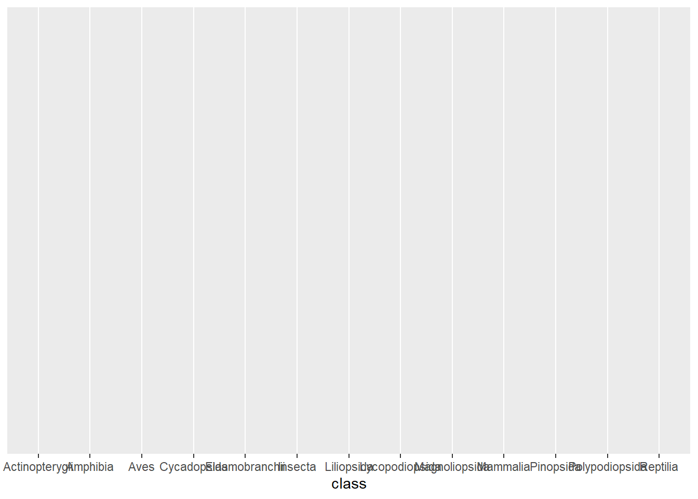


```r
ggplot(data = dat) +
  aes(x = class) +
  geom_bar() #Y añadimos un geom_ para representar geometricamente nuestros datos. Hay que tener precaucion ya que no todos los geom funcionan bien los el aes establezcamos. ggplot realiza algunas graficas de manera predeterminada, si solo dejamos en aes() una unica variable, este graficará el número de observaciones por cada clase que exista en esa variable (geom_bar(stat="count")), ya que convierte en factores las variables para graficarlas
```

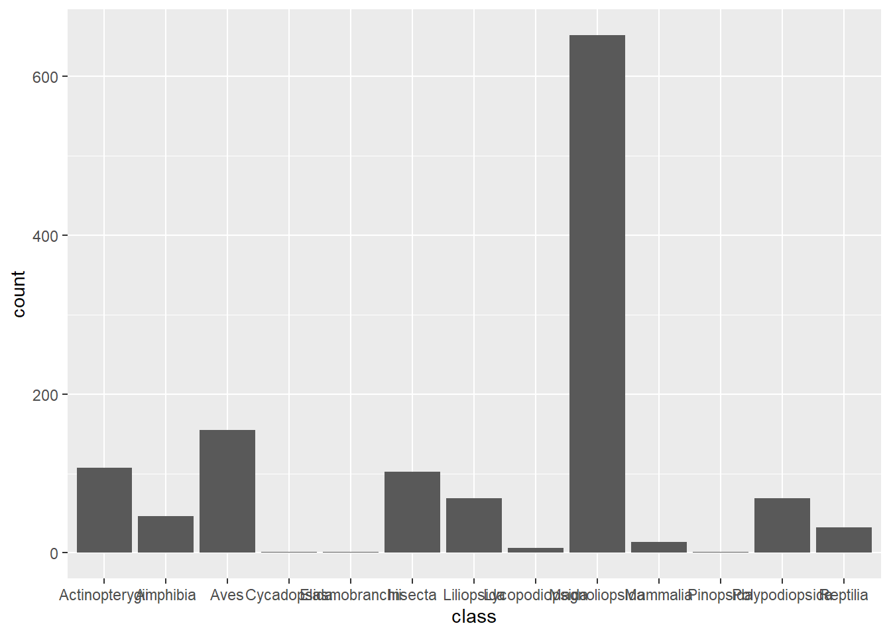

Estos son los 3 componentes principales para crear una gráfica en ggplot. Es posible seguir añadiendo capas para mejorar nuestra grafica y personalizarla de muchas maneras, sin embargo si no se especifican, ggplot los establece por defecto

Al hacer parte del mundo de tidiverse, es posible encadenar la funcion de ggplot con las funciones vistas anteriormente y asi crear un grafico de forma difecta. Vamos a crear una grafica que nos muestre el numero de especies unicas por municipio


```r
dat %>% 
  group_by(municipio) %>% 
  summarise(unicos = unique(species)) %>% 
  ggplot(aes(x = municipio)) +
  geom_bar()
- `summarise()` regrouping output by 'municipio' (override with `.groups` argument)
```

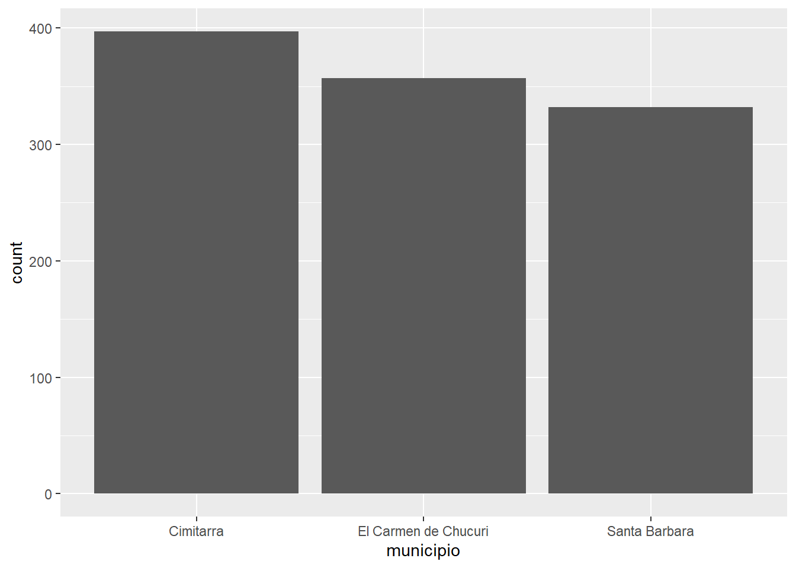

ggplot también establece colores y leyenda por defecto a partir de los factores en el elemento aes con el argumento fill


```r
dat %>% 
  group_by(municipio) %>% 
  summarise(unicos = unique(species)) %>% 
  ggplot(aes(x = municipio, fill = municipio)) +
  geom_bar()
- `summarise()` regrouping output by 'municipio' (override with `.groups` argument)
```

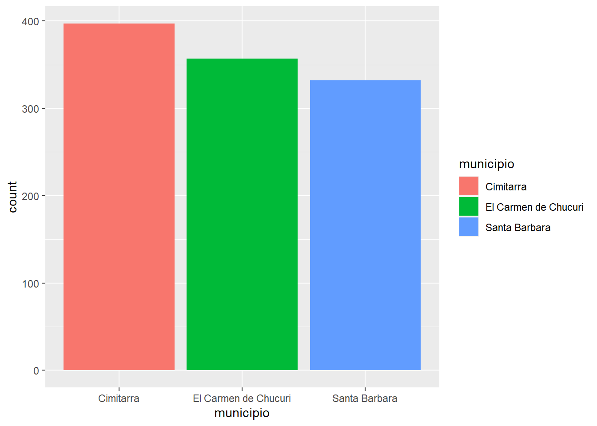

Podemos cambiar el orden de las barras cambiando el eje x a eje y. Si deseamos usar colores específicos para cada barra lo hacemos en el geom_:


```r
dat %>% 
  group_by(municipio) %>% 
  summarise(unicos = unique(species)) %>% 
  ggplot(aes(y = municipio)) +
  geom_bar(fill = c("blue", "yellow", "brown"), col = c("blue", "yellow", "brown")) # ¿Cuál es la diferencia entre fill y col?
- `summarise()` regrouping output by 'municipio' (override with `.groups` argument)
```

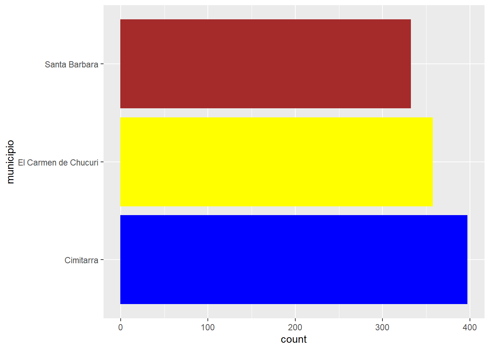

Realice una grafica con ggplot de los registros de mamiferos por cada localidad


```r
dat %>% 
  filter(class == "Mammalia") %>% 
  ggplot(aes(x = locality)) + 
  geom_bar()
```

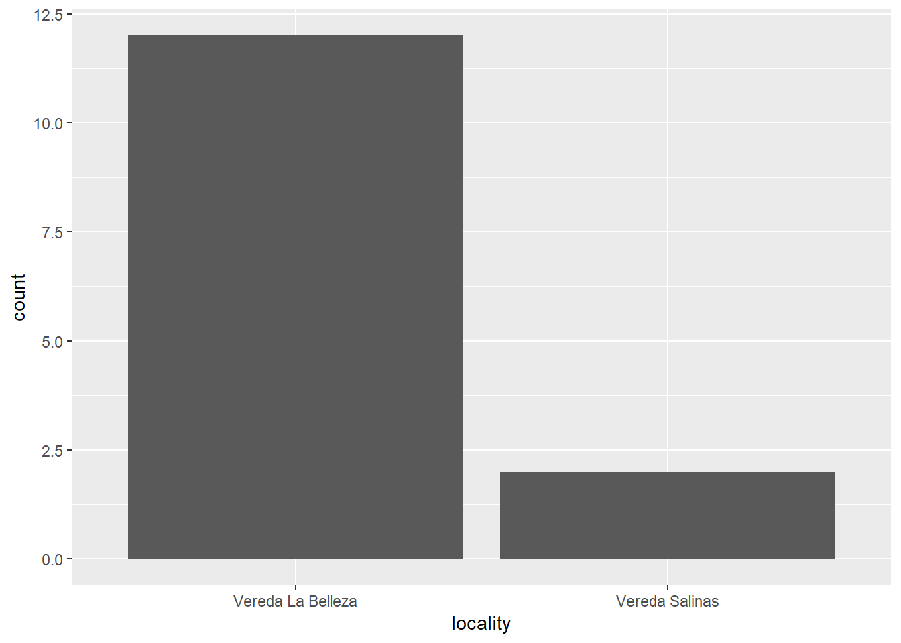

Grafique los registros del orden coleoptera en las diferentes localidades de cada municipio. Para diferenciar a que municipio pertenece cada localidad, usel el argumento fill de aes()


```r
dat %>% 
  filter(order == "Coleoptera") %>% 
  group_by(locality) %>% 
  ggplot(aes(x = locality, fill = municipio)) + 
  geom_bar()
```

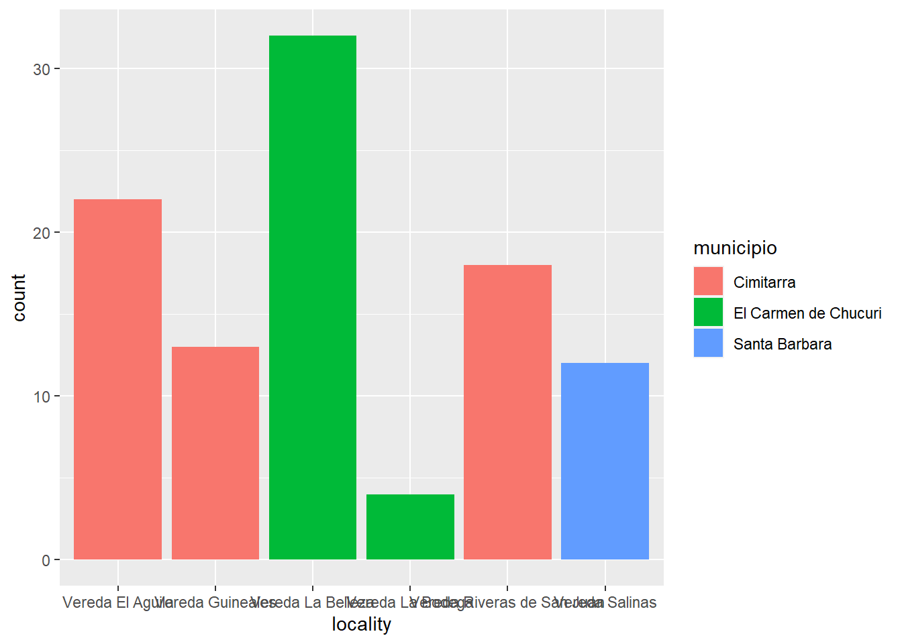

Podemos agruparlos las barras


```r
dat %>% 
  filter(order == "Coleoptera") %>% 
  group_by(locality) %>% 
  ggplot(aes(x = municipio, fill = locality)) + 
  geom_bar(position =  "stack")
```

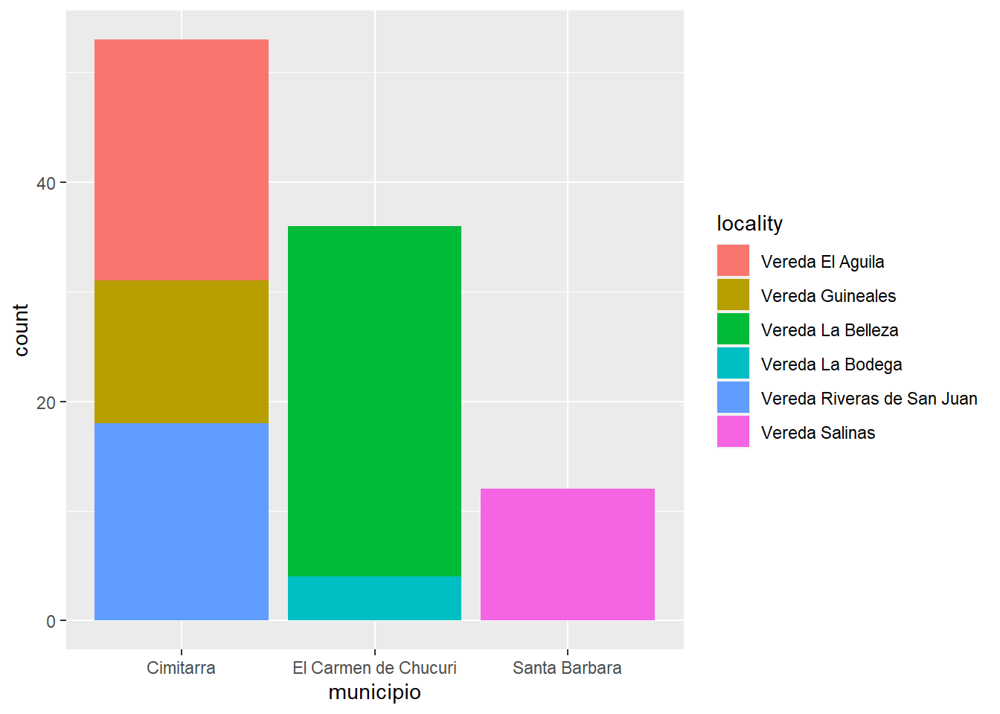

También podemos hacer graficos de cajas e histogramas cambiando de geom_

?geom_boxplot


```r
dat %>% 
  ggplot(aes(x = municipio, y = elevation)) + #Grafico de cajas de la elevacion por cada municipio
  geom_boxplot()
```

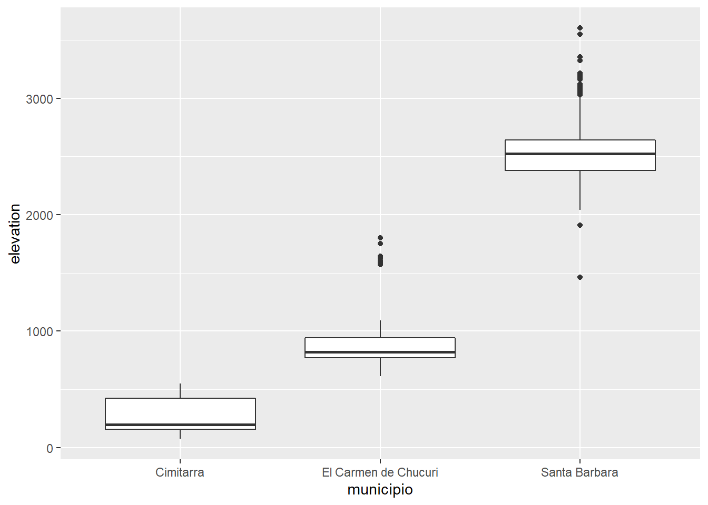

***Ejercicios:***
```
1. Realice un gráfico de cajas sobre la distribucion de las alturas a la que fueron registradas las aves en cada localidad utilizando las funciones tidy

2. ¿Cómo es la distribución de elevacion de las familias del orden Polypodiales?

3. Realice un histograma de la elevación total y la elevación ambos reinos
```

Experimente graficando la elevacion de diferentes grupos (reinos, clase, familia etc) utilizando las funcioens tidy

### Theme

Al igual que en la funcion basica de plot(), en ggplot podemos tener mas de una gráfica y personalizar cada elemento mediante theme()

Ggplot cuenta con temas predeterminados que podemos cargar mediante theme_

?theme()


```r
dat %>% mutate(aleatorios = runif(1255, min = 0, max = 3600)) %>% 
  ggplot(aes(x=elevation, y=aleatorios)) + #establecemos los datos y las variables "x" y "y"
  theme_minimal() #tema del grafico para personalizar color de fondo, bordes, cuadrícula, etc.
```

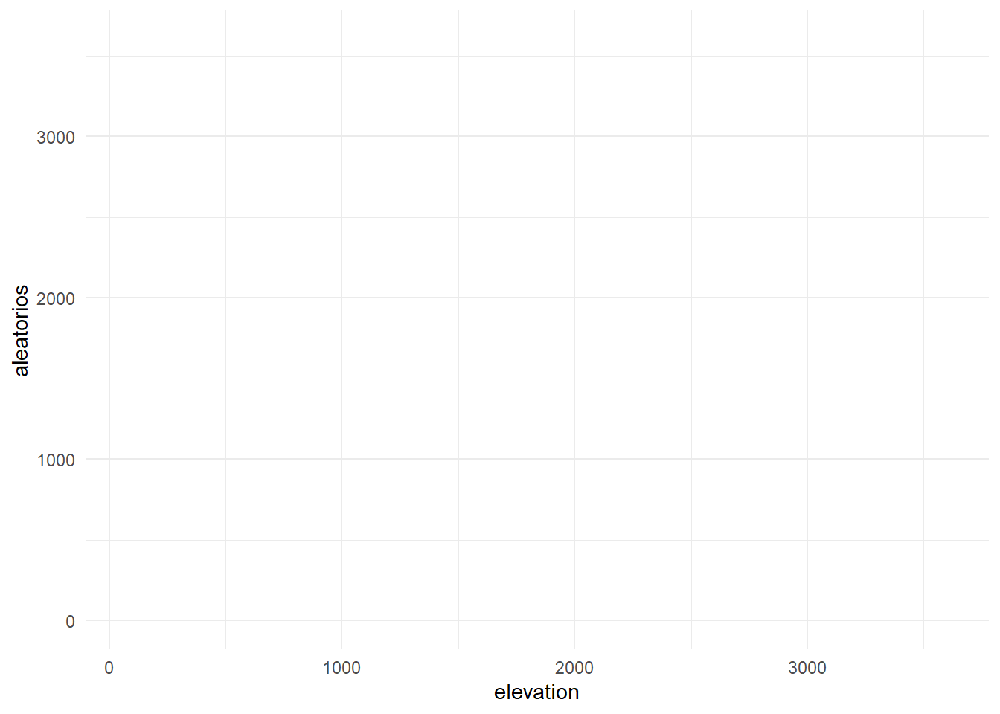

Dentro de theme() modificamos elementos como líneas, colores, ejes, entre otros


```r
dat %>% mutate(aleatorios = runif(1255, min = 0, max = 3600)) %>% 
  ggplot(aes(x=elevation, y=aleatorios)) +
  theme_minimal() + theme(panel.border = element_blank(),
                          panel.grid.major = element_blank(), 
                          panel.grid.minor = element_blank(), 
                          axis.line = element_line(colour = "white")) +#definimos fondo y bordes
  labs(title = "Elevacion vs numeros aleatorios", #título
       subtitle = "Data: SantanderBIO") + #subtítulo
  labs(x = "Elevacion", y = "Numeros aleatorios")#nombre de los ejes
```

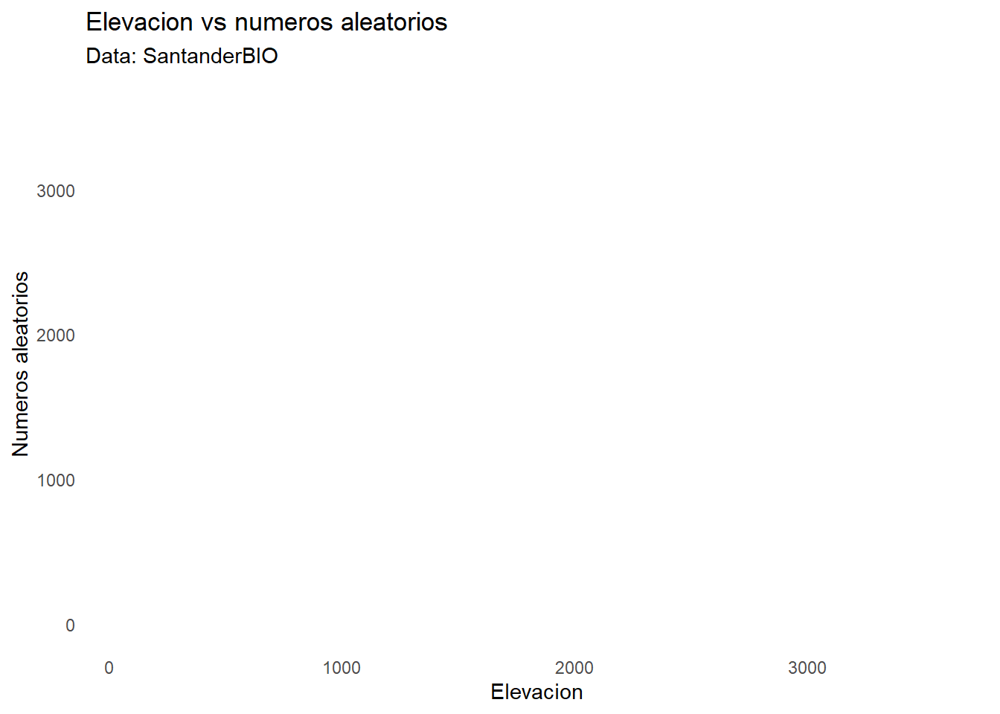

Añadimos un geom_ de puntos


```r
dat %>% mutate(aleatorios = runif(1255, min = 0, max = 3600)) %>% 
  ggplot(aes(x=elevation, y=aleatorios)) + #Grafico base 
  geom_point() + # geometria que corresponde a los puntos
  theme_bw() + theme(panel.border = element_blank(),
                     panel.grid.major = element_blank(), 
                     panel.grid.minor = element_blank(), 
                     axis.line = element_line(colour = "white")) +
  labs(title = "Elevacion vs numeros aleatorios", 
       subtitle = "Data: SantanderBIO") + 
  labs(x = "Elevacion", y = "Numeros aleatorios")
```

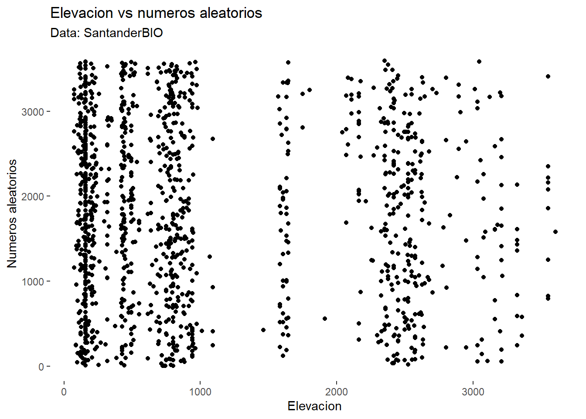

Coloreamos los puntos y modificamos el título de la leyenda generada


```r
dat %>% mutate(aleatorios = runif(1255, min = 0, max = 3600)) %>% 
  ggplot(aes(x=elevation, y=aleatorios, color = municipio)) + #Gráfico base con color para cada punto
  geom_point(shape=5) +  # geometria que corresponde a los puntos y shape para modificar la forma del punto
  theme_bw() + theme(panel.border = element_blank(), 
                     panel.grid.major = element_blank(), 
                     panel.grid.minor = element_blank(), 
                     axis.line = element_line(colour = "white"))+#definimos fondo y bordes
  scale_colour_discrete(name = "Municipios") + #Establecemos el título de la leyenda
  labs(title = "Elevacion vs numeros aleatorios", 
       subtitle = "Data: SantanderBIO") + 
  labs(x = "Elevacion", y = "Numeros aleatorios")
```

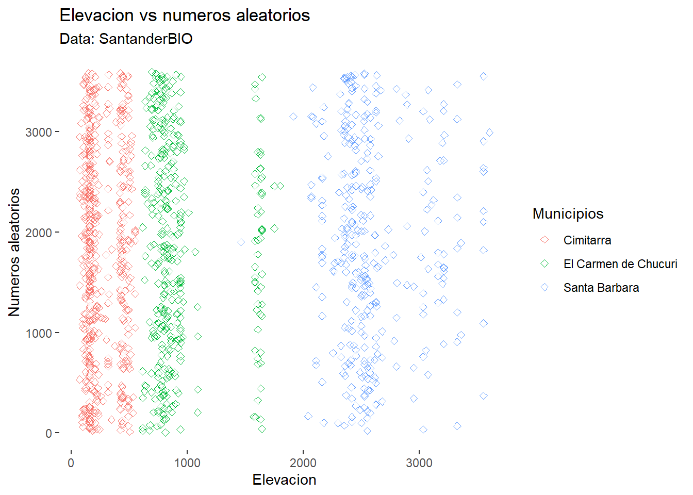

Podemos incluir en la gráfica algunos métodos estadísticos como la relación lineal entre los puntos

?geom_smooth


```r
dat %>% mutate(aleatorios = runif(1255, min = 0, max = 3600)) %>% 
  ggplot(aes(x=elevation, y=aleatorios)) + 
  geom_point(shape=5) +  
  geom_smooth(method = "lm", se = TRUE) + #método lm e intervalo de confianza
  theme_bw() + theme(panel.border = element_blank(), 
                     panel.grid.major = element_blank(), 
                     panel.grid.minor = element_blank(), 
                     axis.line = element_line(colour = "white")) +
  scale_colour_discrete(name = "Municipios") + 
  labs(title = "Elevacion vs numeros aleatorios", 
       subtitle = "Data: SantanderBIO") + 
  labs(x = "Elevacion", y = "Numeros aleatorios")
- `geom_smooth()` using formula 'y ~ x'
```

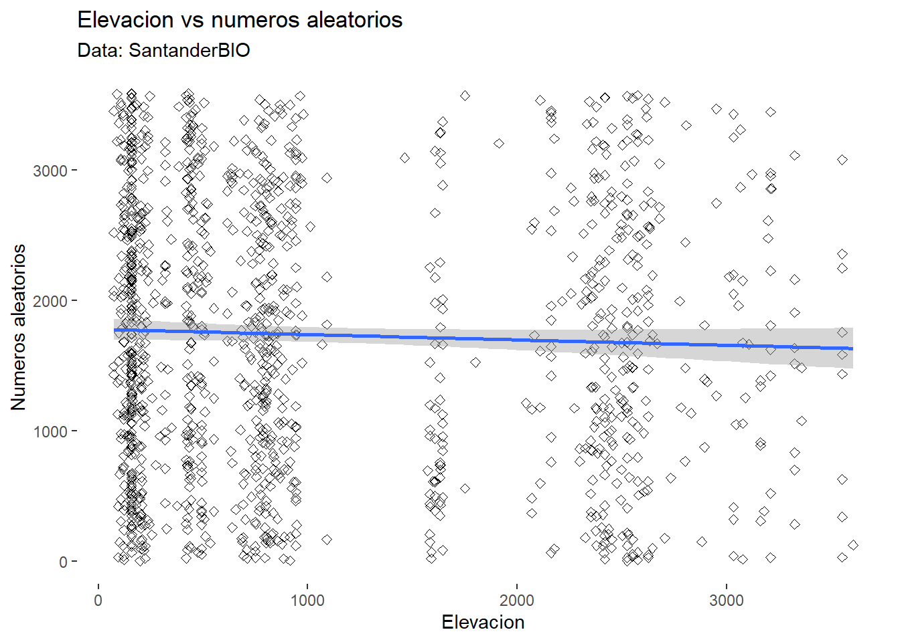

Y por cada grupo


```r
dat %>% mutate(aleatorios = runif(1255, min = 0, max = 3600)) %>% 
  ggplot(aes(x=elevation, y=aleatorios, color = municipio)) + 
  geom_point(shape=5) +  
  geom_smooth(method = "lm", se = TRUE) +
  theme_bw() + theme(panel.border = element_blank(), 
                     panel.grid.major = element_blank(), 
                     panel.grid.minor = element_blank(), 
                     axis.line = element_line(colour = "white")) +
  scale_colour_discrete(name = "Municipios") + 
  labs(title = "Elevacion vs numeros aleatorios", 
       subtitle = "Data: SantanderBIO") + 
  labs(x = "Elevacion", y = "Numeros aleatorios")
- `geom_smooth()` using formula 'y ~ x'
```

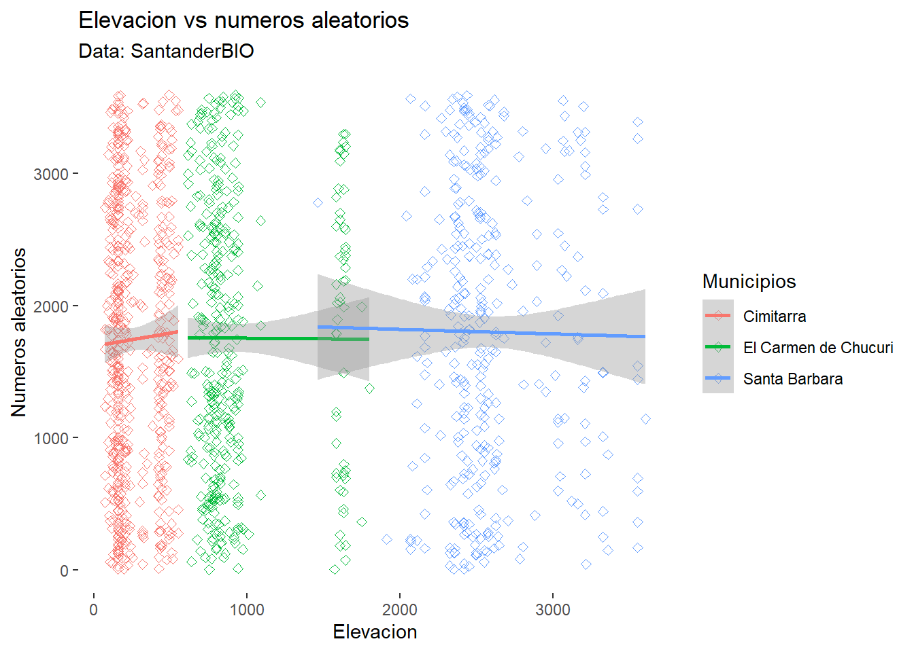

Podemos graficar una variable por cada grupo con colores que se sobreponen


```r
ggplot(data = dat) + 
  geom_histogram(aes(x = elevation, fill = municipio), 
                 bins = 12, position = "identity", alpha = 0.4) + # alpha para ver las barras que se sobreponen
  theme_bw() + theme(panel.border = element_blank(), 
                     panel.grid.major = element_blank(), 
                     panel.grid.minor = element_blank(), 
                     axis.line = element_line(colour = "white")) +
  labs(title = "Elevacion por municipio", 
       subtitle = "Data: SantanderBIO") + 
  labs(x = "Elevacion", y = "Conteo")
```

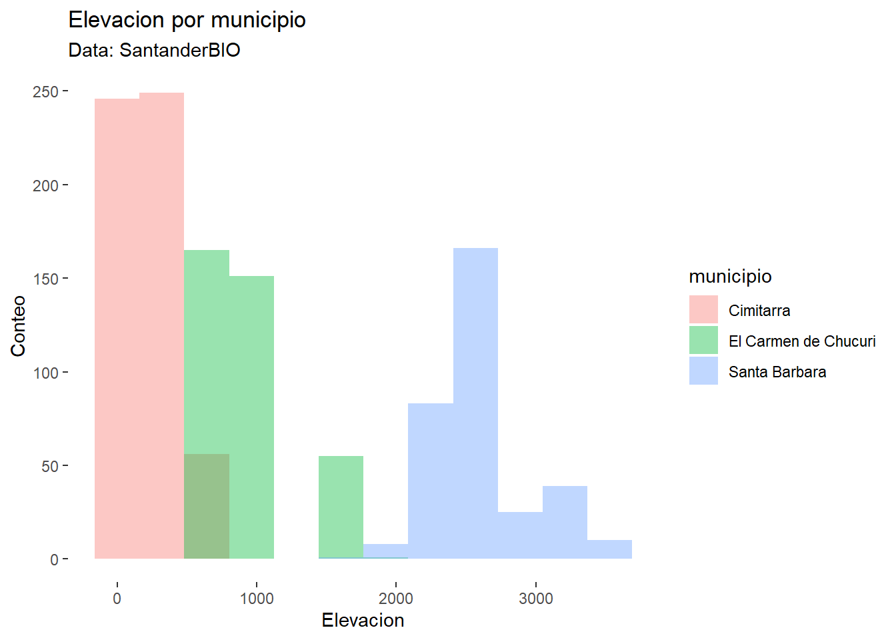

Para poder mostrar mas de una gráfica en el mismo plot se utiliza face_wrap. Revise la función y realice el histograma anterior pero realice en un mismo plot 3 gráficas para cada municipio

?facet_wrap


```r
ggplot(data = dat) + 
  geom_histogram(aes(x = elevation, fill = municipio), bins = 12) + 
  facet_wrap(~municipio, ncol = 1)+ #para cada especie, haga tres histogramas en una columna
  theme_bw() + theme(panel.border = element_blank(), 
                     panel.grid.major = element_blank(), 
                     panel.grid.minor = element_blank(), 
                     axis.line = element_line(colour = "white")) +
  labs(title = "Elevacion por municipio", 
       subtitle = "Data: SantanderBIO") + 
  labs(x = "Elevacion", y = "Conteo")
```

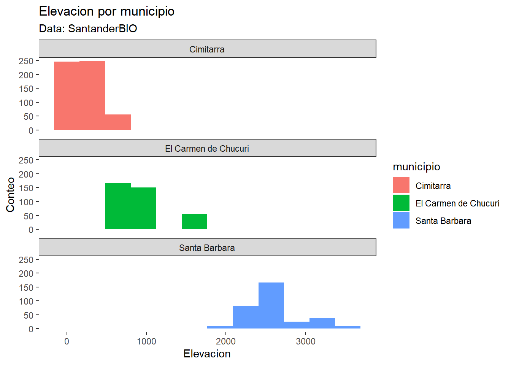

Todas las características de un tema pueden ser guardadas en un vector para evitar escribir el tema cada vez que se grafique


```r
mitema <- theme(panel.grid.major = element_line(colour = "green"), 
                panel.grid.minor = element_line(colour = "pink"),
                panel.background = element_rect(fill = "blue"),
                panel.border = element_blank(),axis.line = element_line(size = 0.9, linetype = "solid", colour = "black"))

ggplot(data = dat, aes(x = elevation, y = elevation)) +
  mitema
```

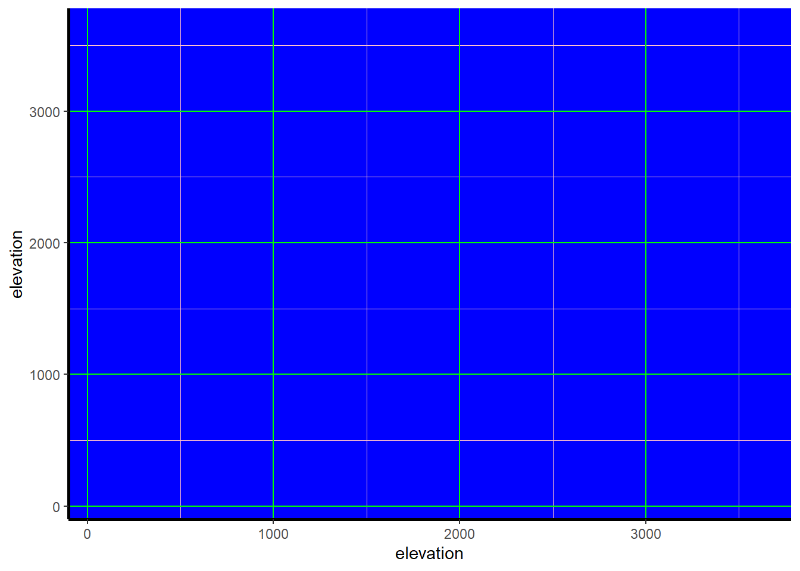

***Ejercicios:***
```
1.Contruye tu propio tema personalizado

2. Cree una grafica de barras de el numero de individuos por cada clase, utilice color para las diferentes barras. Adicionalmente, utilice su propio tema

3.Realice el grafico anterior pero genere una grafica separada para clada clase en el mismo plot

4. Convierta la grafica de barras del punto 2 en una grafica de torta meidante coord_polar()
```

Finalmente, con el sistema de coordenadas "x" y "y" es posible hacer increíbles mapas mediante ggplot 


```r
nz <- map_data("nz") #Cargamos un set de datos que contienede coordenadas longitud y latitud, y columnas que indican a que región corresponden esas coordenadas

ggplot(nz, aes(long, lat, group = group)) +
  geom_polygon(fill = "white", colour = "black")
```

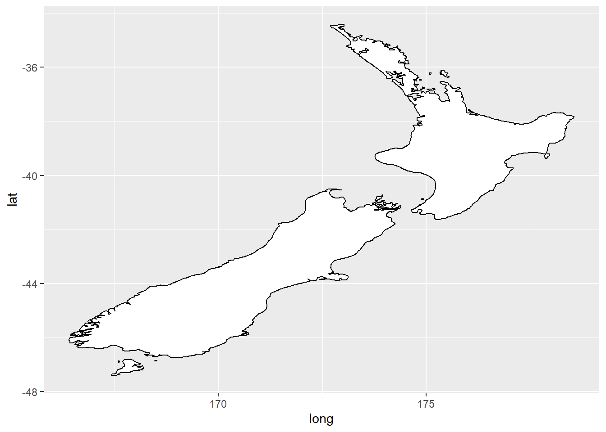

## Forcats                             

El paquete forcats tiene como objetivo brindar herramientas de ayuda para manejar variables categóricas.

Convirtamos una variable en un factor


```r
dat$class <- as.factor(dat$class)

levels(dat$class) #Revisamos los categorias
-  [1] "Actinopterygii" "Amphibia"       "Aves"           "Cycadopsida"   
-  [5] "Elasmobranchii" "Insecta"        "Liliopsida"     "Lycopodiopsida"
-  [9] "Magnoliopsida"  "Mammalia"       "Pinopsida"      "Polypodiopsida"
- [13] "Reptilia"
dat %>% 
  ggplot(aes(x = class)) + 
  geom_bar() + 
  coord_flip()
```

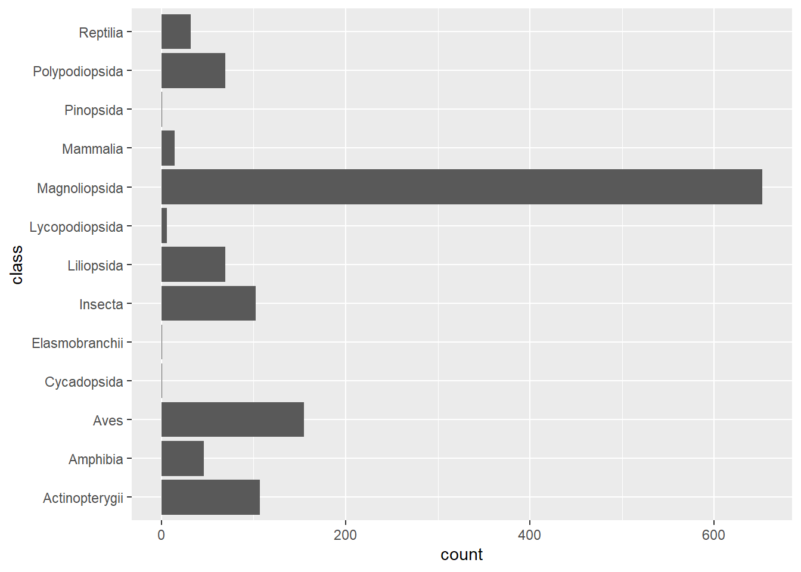

Vemos que se grafica un conteo de la variable "class" por cada factor, ahora vamos a ordenar esta gráfica con forcats


```r
dat %>% 
  mutate(class = fct_infreq(class)) %>% 
  ggplot(aes(x = class)) + 
  geom_bar() + 
  coord_flip()
```

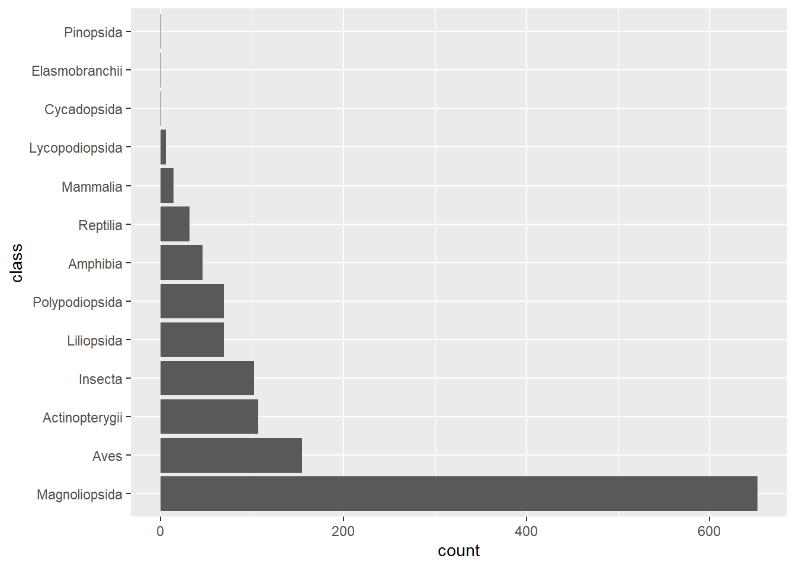

```r
#Ahora tenemos los cada categoria ordenada por su frecuencia
```

Podemos ordenar un factor por otra variable


```r
dat %>% 
  ggplot(aes(x = class, y = elevation)) + 
  geom_boxplot() 
```

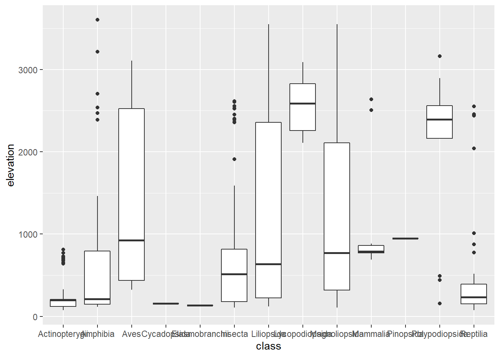

```r
#Bloxplot de la distribución del a altura por cada clase

dat %>% 
  mutate(class = fct_reorder(class, elevation)) %>% 
  ggplot(aes(x = class, y = elevation)) + 
  geom_boxplot()
```

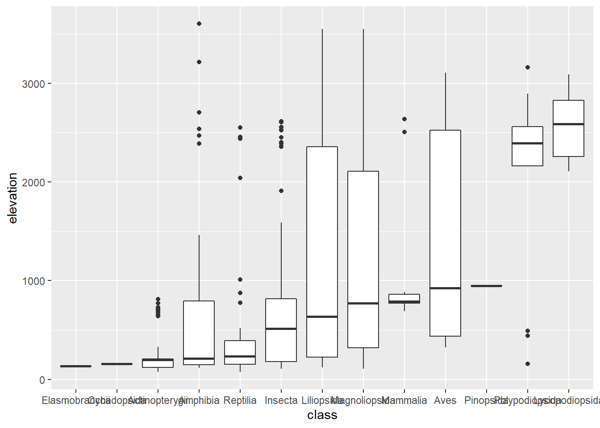

```r
#En este caso ordenamos las clases por la mediana de sus elevaciones
```

Si tenemos clases con pocas o muchas observaciones podemos agruparlos en un nuevo grupo llamado "other". Explique la diferencia entre las dos gráficas


```r
dat %>% 
  mutate(class = fct_lump(class, n = 5)) %>% 
  ggplot(aes(x = class)) + 
  geom_bar() + 
  coord_flip()
```

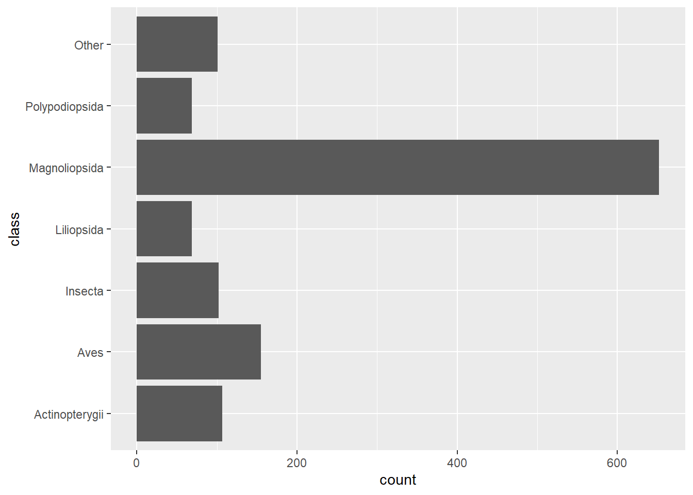

```r
dat %>% 
  mutate(class = fct_lump(class, n = -5)) %>% 
  ggplot(aes(x = class)) + 
  geom_bar() + 
  coord_flip()
```

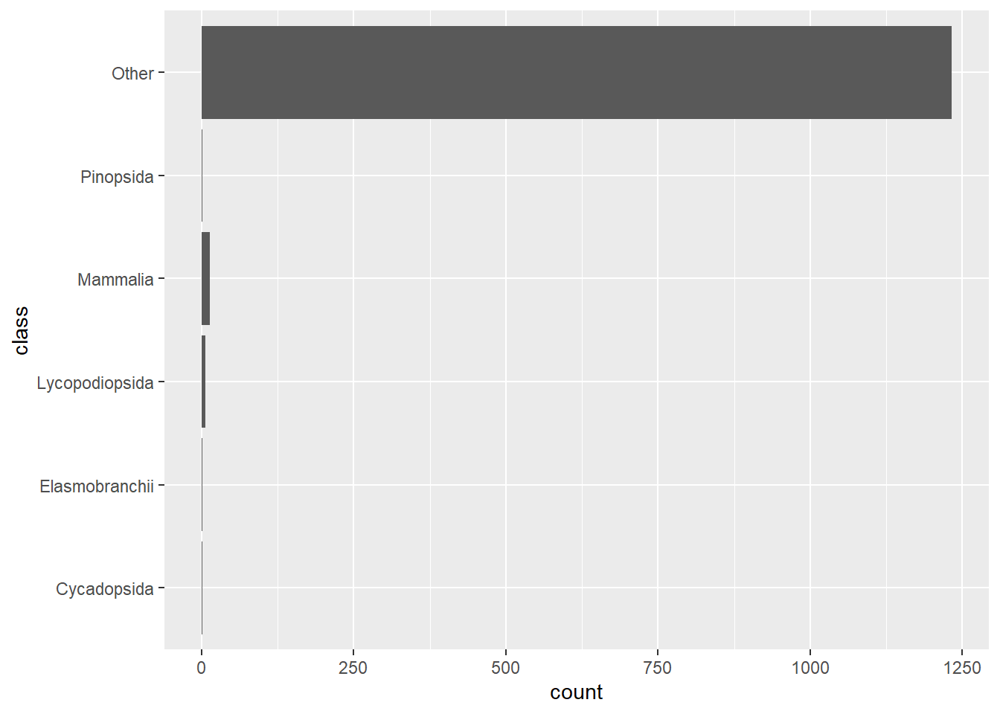

forcats tambien nos permite ordenar las categorias a mano


```r
f <- as.factor(dat$phylum)
levels(f)
- [1] "Arthropoda"   "Chordata"     "Tracheophyta"
fct_relevel(f, "Tracheophyta", "Arthropoda", "Chordata")
-    [1] Tracheophyta Tracheophyta Tracheophyta Tracheophyta Tracheophyta
-    [6] Tracheophyta Tracheophyta Chordata     Tracheophyta Chordata    
-   [11] Tracheophyta Tracheophyta Chordata     Chordata     Tracheophyta
-   [16] Chordata     Chordata     Tracheophyta Chordata     Chordata    
-   [21] Chordata     Chordata     Chordata     Tracheophyta Arthropoda  
-   [26] Arthropoda   Arthropoda   Arthropoda   Arthropoda   Arthropoda  
-   [31] Tracheophyta Tracheophyta Tracheophyta Tracheophyta Tracheophyta
-   [36] Tracheophyta Tracheophyta Tracheophyta Tracheophyta Arthropoda  
-   [41] Tracheophyta Tracheophyta Tracheophyta Chordata     Chordata    
-   [46] Tracheophyta Tracheophyta Tracheophyta Chordata     Arthropoda  
-   [51] Arthropoda   Arthropoda   Chordata     Tracheophyta Chordata    
-   [56] Tracheophyta Arthropoda   Tracheophyta Tracheophyta Tracheophyta
-   [61] Chordata     Tracheophyta Chordata     Tracheophyta Arthropoda  
-   [66] Arthropoda   Arthropoda   Tracheophyta Tracheophyta Tracheophyta
-   [71] Tracheophyta Tracheophyta Tracheophyta Chordata     Tracheophyta
-   [76] Chordata     Chordata     Tracheophyta Tracheophyta Tracheophyta
-   [81] Tracheophyta Tracheophyta Tracheophyta Tracheophyta Tracheophyta
-   [86] Tracheophyta Tracheophyta Tracheophyta Tracheophyta Tracheophyta
-   [91] Chordata     Chordata     Tracheophyta Tracheophyta Chordata    
-   [96] Chordata     Chordata     Chordata     Tracheophyta Tracheophyta
-  [101] Tracheophyta Tracheophyta Tracheophyta Tracheophyta Tracheophyta
-  [106] Tracheophyta Tracheophyta Chordata     Chordata     Chordata    
-  [111] Chordata     Chordata     Tracheophyta Chordata     Chordata    
-  [116] Tracheophyta Tracheophyta Tracheophyta Tracheophyta Tracheophyta
-  [121] Tracheophyta Tracheophyta Tracheophyta Tracheophyta Tracheophyta
-  [126] Tracheophyta Tracheophyta Tracheophyta Tracheophyta Tracheophyta
-  [131] Tracheophyta Arthropoda   Arthropoda   Arthropoda   Arthropoda  
-  [136] Arthropoda   Arthropoda   Tracheophyta Tracheophyta Tracheophyta
-  [141] Tracheophyta Tracheophyta Tracheophyta Tracheophyta Tracheophyta
-  [146] Tracheophyta Tracheophyta Tracheophyta Tracheophyta Tracheophyta
-  [151] Arthropoda   Tracheophyta Chordata     Tracheophyta Tracheophyta
-  [156] Tracheophyta Chordata     Chordata     Tracheophyta Chordata    
-  [161] Tracheophyta Tracheophyta Tracheophyta Tracheophyta Tracheophyta
-  [166] Tracheophyta Chordata     Chordata     Chordata     Chordata    
-  [171] Chordata     Tracheophyta Tracheophyta Tracheophyta Chordata    
-  [176] Chordata     Tracheophyta Tracheophyta Tracheophyta Chordata    
-  [181] Chordata     Chordata     Chordata     Tracheophyta Tracheophyta
-  [186] Tracheophyta Tracheophyta Chordata     Tracheophyta Tracheophyta
-  [191] Tracheophyta Chordata     Chordata     Tracheophyta Arthropoda  
-  [196] Chordata     Tracheophyta Tracheophyta Tracheophyta Tracheophyta
-  [201] Tracheophyta Tracheophyta Tracheophyta Tracheophyta Tracheophyta
-  [206] Tracheophyta Tracheophyta Tracheophyta Tracheophyta Tracheophyta
-  [211] Tracheophyta Tracheophyta Tracheophyta Tracheophyta Tracheophyta
-  [216] Tracheophyta Tracheophyta Tracheophyta Tracheophyta Tracheophyta
-  [221] Tracheophyta Chordata     Chordata     Chordata     Chordata    
-  [226] Tracheophyta Chordata     Chordata     Tracheophyta Tracheophyta
-  [231] Chordata     Chordata     Chordata     Chordata     Chordata    
-  [236] Tracheophyta Chordata     Tracheophyta Tracheophyta Chordata    
-  [241] Chordata     Chordata     Tracheophyta Arthropoda   Chordata    
-  [246] Tracheophyta Tracheophyta Tracheophyta Chordata     Chordata    
-  [251] Tracheophyta Tracheophyta Tracheophyta Tracheophyta Chordata    
-  [256] Tracheophyta Chordata     Arthropoda   Tracheophyta Tracheophyta
-  [261] Chordata     Chordata     Chordata     Chordata     Chordata    
-  [266] Chordata     Chordata     Chordata     Chordata     Tracheophyta
-  [271] Chordata     Tracheophyta Arthropoda   Chordata     Tracheophyta
-  [276] Tracheophyta Chordata     Chordata     Chordata     Tracheophyta
-  [281] Arthropoda   Arthropoda   Arthropoda   Tracheophyta Chordata    
-  [286] Tracheophyta Chordata     Chordata     Chordata     Chordata    
-  [291] Chordata     Tracheophyta Tracheophyta Chordata     Tracheophyta
-  [296] Tracheophyta Chordata     Chordata     Tracheophyta Tracheophyta
-  [301] Tracheophyta Chordata     Chordata     Chordata     Chordata    
-  [306] Chordata     Chordata     Tracheophyta Tracheophyta Tracheophyta
-  [311] Tracheophyta Chordata     Chordata     Chordata     Chordata    
-  [316] Chordata     Chordata     Chordata     Tracheophyta Tracheophyta
-  [321] Chordata     Tracheophyta Tracheophyta Tracheophyta Tracheophyta
-  [326] Tracheophyta Tracheophyta Tracheophyta Tracheophyta Chordata    
-  [331] Tracheophyta Chordata     Tracheophyta Chordata     Chordata    
-  [336] Tracheophyta Chordata     Arthropoda   Arthropoda   Tracheophyta
-  [341] Arthropoda   Tracheophyta Tracheophyta Tracheophyta Chordata    
-  [346] Chordata     Chordata     Arthropoda   Chordata     Chordata    
-  [351] Tracheophyta Tracheophyta Tracheophyta Tracheophyta Chordata    
-  [356] Tracheophyta Chordata     Chordata     Tracheophyta Chordata    
-  [361] Chordata     Chordata     Tracheophyta Chordata     Chordata    
-  [366] Chordata     Chordata     Chordata     Chordata     Tracheophyta
-  [371] Tracheophyta Chordata     Tracheophyta Tracheophyta Chordata    
-  [376] Tracheophyta Chordata     Chordata     Chordata     Tracheophyta
-  [381] Arthropoda   Tracheophyta Arthropoda   Chordata     Tracheophyta
-  [386] Tracheophyta Tracheophyta Tracheophyta Chordata     Chordata    
-  [391] Tracheophyta Tracheophyta Arthropoda   Chordata     Tracheophyta
-  [396] Chordata     Tracheophyta Tracheophyta Chordata     Tracheophyta
-  [401] Tracheophyta Tracheophyta Tracheophyta Tracheophyta Tracheophyta
-  [406] Tracheophyta Arthropoda   Tracheophyta Tracheophyta Tracheophyta
-  [411] Tracheophyta Chordata     Chordata     Chordata     Tracheophyta
-  [416] Chordata     Tracheophyta Tracheophyta Tracheophyta Chordata    
-  [421] Arthropoda   Chordata     Chordata     Chordata     Chordata    
-  [426] Tracheophyta Chordata     Tracheophyta Tracheophyta Tracheophyta
-  [431] Tracheophyta Tracheophyta Arthropoda   Tracheophyta Tracheophyta
-  [436] Tracheophyta Tracheophyta Arthropoda   Arthropoda   Chordata    
-  [441] Arthropoda   Chordata     Chordata     Tracheophyta Tracheophyta
-  [446] Chordata     Tracheophyta Tracheophyta Chordata     Chordata    
-  [451] Tracheophyta Chordata     Tracheophyta Chordata     Arthropoda  
-  [456] Chordata     Tracheophyta Tracheophyta Tracheophyta Tracheophyta
-  [461] Tracheophyta Tracheophyta Tracheophyta Tracheophyta Tracheophyta
-  [466] Arthropoda   Chordata     Tracheophyta Tracheophyta Chordata    
-  [471] Chordata     Chordata     Tracheophyta Tracheophyta Tracheophyta
-  [476] Chordata     Tracheophyta Chordata     Tracheophyta Tracheophyta
-  [481] Arthropoda   Arthropoda   Arthropoda   Arthropoda   Arthropoda  
-  [486] Arthropoda   Arthropoda   Tracheophyta Chordata     Arthropoda  
-  [491] Chordata     Chordata     Chordata     Tracheophyta Chordata    
-  [496] Tracheophyta Tracheophyta Tracheophyta Tracheophyta Tracheophyta
-  [501] Tracheophyta Arthropoda   Chordata     Chordata     Tracheophyta
-  [506] Tracheophyta Chordata     Tracheophyta Chordata     Arthropoda  
-  [511] Chordata     Arthropoda   Tracheophyta Chordata     Tracheophyta
-  [516] Chordata     Chordata     Tracheophyta Tracheophyta Tracheophyta
-  [521] Chordata     Chordata     Chordata     Tracheophyta Tracheophyta
-  [526] Tracheophyta Tracheophyta Tracheophyta Tracheophyta Tracheophyta
-  [531] Arthropoda   Chordata     Tracheophyta Tracheophyta Tracheophyta
-  [536] Tracheophyta Chordata     Chordata     Chordata     Tracheophyta
-  [541] Tracheophyta Chordata     Arthropoda   Chordata     Tracheophyta
-  [546] Tracheophyta Tracheophyta Tracheophyta Tracheophyta Tracheophyta
-  [551] Tracheophyta Chordata     Tracheophyta Arthropoda   Arthropoda  
-  [556] Chordata     Tracheophyta Chordata     Chordata     Chordata    
-  [561] Chordata     Chordata     Tracheophyta Chordata     Tracheophyta
-  [566] Chordata     Tracheophyta Tracheophyta Tracheophyta Chordata    
-  [571] Tracheophyta Tracheophyta Tracheophyta Tracheophyta Tracheophyta
-  [576] Tracheophyta Tracheophyta Tracheophyta Tracheophyta Tracheophyta
-  [581] Tracheophyta Tracheophyta Tracheophyta Tracheophyta Tracheophyta
-  [586] Tracheophyta Tracheophyta Tracheophyta Tracheophyta Tracheophyta
-  [591] Tracheophyta Tracheophyta Tracheophyta Tracheophyta Tracheophyta
-  [596] Tracheophyta Tracheophyta Tracheophyta Tracheophyta Tracheophyta
-  [601] Tracheophyta Tracheophyta Chordata     Chordata     Chordata    
-  [606] Tracheophyta Tracheophyta Chordata     Chordata     Tracheophyta
-  [611] Tracheophyta Tracheophyta Tracheophyta Tracheophyta Tracheophyta
-  [616] Tracheophyta Chordata     Tracheophyta Tracheophyta Tracheophyta
-  [621] Tracheophyta Arthropoda   Chordata     Tracheophyta Tracheophyta
-  [626] Tracheophyta Tracheophyta Chordata     Arthropoda   Arthropoda  
-  [631] Tracheophyta Tracheophyta Arthropoda   Tracheophyta Chordata    
-  [636] Chordata     Chordata     Chordata     Arthropoda   Arthropoda  
-  [641] Chordata     Tracheophyta Chordata     Chordata     Tracheophyta
-  [646] Tracheophyta Tracheophyta Chordata     Tracheophyta Chordata    
-  [651] Tracheophyta Chordata     Arthropoda   Tracheophyta Chordata    
-  [656] Tracheophyta Tracheophyta Chordata     Chordata     Tracheophyta
-  [661] Tracheophyta Tracheophyta Tracheophyta Tracheophyta Tracheophyta
-  [666] Tracheophyta Tracheophyta Tracheophyta Chordata     Chordata    
-  [671] Tracheophyta Tracheophyta Tracheophyta Tracheophyta Tracheophyta
-  [676] Tracheophyta Tracheophyta Tracheophyta Tracheophyta Tracheophyta
-  [681] Tracheophyta Tracheophyta Tracheophyta Tracheophyta Chordata    
-  [686] Tracheophyta Tracheophyta Arthropoda   Tracheophyta Tracheophyta
-  [691] Tracheophyta Chordata     Chordata     Tracheophyta Tracheophyta
-  [696] Chordata     Chordata     Chordata     Tracheophyta Tracheophyta
-  [701] Tracheophyta Tracheophyta Chordata     Chordata     Chordata    
-  [706] Arthropoda   Chordata     Chordata     Tracheophyta Tracheophyta
-  [711] Chordata     Tracheophyta Tracheophyta Tracheophyta Chordata    
-  [716] Tracheophyta Tracheophyta Tracheophyta Tracheophyta Tracheophyta
-  [721] Tracheophyta Tracheophyta Tracheophyta Tracheophyta Tracheophyta
-  [726] Tracheophyta Tracheophyta Tracheophyta Tracheophyta Tracheophyta
-  [731] Tracheophyta Arthropoda   Tracheophyta Tracheophyta Tracheophyta
-  [736] Tracheophyta Tracheophyta Tracheophyta Tracheophyta Tracheophyta
-  [741] Tracheophyta Tracheophyta Tracheophyta Tracheophyta Tracheophyta
-  [746] Tracheophyta Tracheophyta Tracheophyta Tracheophyta Tracheophyta
-  [751] Tracheophyta Tracheophyta Tracheophyta Tracheophyta Tracheophyta
-  [756] Tracheophyta Tracheophyta Tracheophyta Tracheophyta Tracheophyta
-  [761] Arthropoda   Tracheophyta Tracheophyta Tracheophyta Tracheophyta
-  [766] Tracheophyta Tracheophyta Tracheophyta Tracheophyta Tracheophyta
-  [771] Tracheophyta Arthropoda   Arthropoda   Tracheophyta Tracheophyta
-  [776] Tracheophyta Tracheophyta Tracheophyta Tracheophyta Tracheophyta
-  [781] Tracheophyta Tracheophyta Tracheophyta Tracheophyta Tracheophyta
-  [786] Chordata     Chordata     Tracheophyta Tracheophyta Tracheophyta
-  [791] Tracheophyta Tracheophyta Tracheophyta Tracheophyta Tracheophyta
-  [796] Tracheophyta Tracheophyta Tracheophyta Tracheophyta Tracheophyta
-  [801] Tracheophyta Tracheophyta Tracheophyta Tracheophyta Tracheophyta
-  [806] Tracheophyta Tracheophyta Tracheophyta Tracheophyta Tracheophyta
-  [811] Tracheophyta Tracheophyta Tracheophyta Tracheophyta Tracheophyta
-  [816] Tracheophyta Tracheophyta Tracheophyta Tracheophyta Tracheophyta
-  [821] Tracheophyta Tracheophyta Tracheophyta Tracheophyta Tracheophyta
-  [826] Tracheophyta Tracheophyta Chordata     Tracheophyta Tracheophyta
-  [831] Tracheophyta Tracheophyta Tracheophyta Tracheophyta Tracheophyta
-  [836] Tracheophyta Tracheophyta Tracheophyta Tracheophyta Tracheophyta
-  [841] Tracheophyta Tracheophyta Tracheophyta Tracheophyta Tracheophyta
-  [846] Tracheophyta Tracheophyta Tracheophyta Tracheophyta Tracheophyta
-  [851] Tracheophyta Tracheophyta Tracheophyta Tracheophyta Tracheophyta
-  [856] Chordata     Tracheophyta Tracheophyta Tracheophyta Tracheophyta
-  [861] Chordata     Tracheophyta Tracheophyta Tracheophyta Tracheophyta
-  [866] Tracheophyta Tracheophyta Tracheophyta Tracheophyta Tracheophyta
-  [871] Tracheophyta Tracheophyta Tracheophyta Tracheophyta Tracheophyta
-  [876] Tracheophyta Tracheophyta Tracheophyta Tracheophyta Tracheophyta
-  [881] Tracheophyta Tracheophyta Tracheophyta Tracheophyta Tracheophyta
-  [886] Tracheophyta Chordata     Tracheophyta Tracheophyta Tracheophyta
-  [891] Tracheophyta Tracheophyta Tracheophyta Tracheophyta Tracheophyta
-  [896] Tracheophyta Tracheophyta Tracheophyta Tracheophyta Tracheophyta
-  [901] Tracheophyta Tracheophyta Tracheophyta Tracheophyta Tracheophyta
-  [906] Tracheophyta Tracheophyta Tracheophyta Tracheophyta Tracheophyta
-  [911] Tracheophyta Tracheophyta Tracheophyta Tracheophyta Tracheophyta
-  [916] Tracheophyta Tracheophyta Tracheophyta Tracheophyta Tracheophyta
-  [921] Tracheophyta Tracheophyta Tracheophyta Tracheophyta Tracheophyta
-  [926] Tracheophyta Tracheophyta Tracheophyta Tracheophyta Tracheophyta
-  [931] Tracheophyta Tracheophyta Tracheophyta Tracheophyta Tracheophyta
-  [936] Tracheophyta Tracheophyta Tracheophyta Tracheophyta Tracheophyta
-  [941] Tracheophyta Tracheophyta Tracheophyta Tracheophyta Tracheophyta
-  [946] Tracheophyta Tracheophyta Tracheophyta Tracheophyta Tracheophyta
-  [951] Tracheophyta Tracheophyta Tracheophyta Tracheophyta Tracheophyta
-  [956] Tracheophyta Tracheophyta Tracheophyta Tracheophyta Tracheophyta
-  [961] Tracheophyta Tracheophyta Tracheophyta Tracheophyta Tracheophyta
-  [966] Tracheophyta Tracheophyta Tracheophyta Tracheophyta Tracheophyta
-  [971] Tracheophyta Tracheophyta Tracheophyta Tracheophyta Tracheophyta
-  [976] Tracheophyta Chordata     Chordata     Chordata     Chordata    
-  [981] Tracheophyta Tracheophyta Tracheophyta Tracheophyta Tracheophyta
-  [986] Tracheophyta Tracheophyta Tracheophyta Tracheophyta Tracheophyta
-  [991] Tracheophyta Tracheophyta Tracheophyta Tracheophyta Tracheophyta
-  [996] Tracheophyta Tracheophyta Tracheophyta Tracheophyta Tracheophyta
- [1001] Tracheophyta Tracheophyta Tracheophyta Tracheophyta Tracheophyta
- [1006] Tracheophyta Tracheophyta Tracheophyta Tracheophyta Tracheophyta
- [1011] Tracheophyta Tracheophyta Tracheophyta Tracheophyta Tracheophyta
- [1016] Tracheophyta Tracheophyta Tracheophyta Tracheophyta Tracheophyta
- [1021] Tracheophyta Chordata     Tracheophyta Tracheophyta Tracheophyta
- [1026] Tracheophyta Tracheophyta Tracheophyta Tracheophyta Tracheophyta
- [1031] Tracheophyta Tracheophyta Tracheophyta Tracheophyta Tracheophyta
- [1036] Tracheophyta Tracheophyta Tracheophyta Tracheophyta Tracheophyta
- [1041] Tracheophyta Chordata     Tracheophyta Tracheophyta Tracheophyta
- [1046] Tracheophyta Chordata     Chordata     Tracheophyta Tracheophyta
- [1051] Tracheophyta Tracheophyta Tracheophyta Chordata     Tracheophyta
- [1056] Tracheophyta Tracheophyta Chordata     Tracheophyta Tracheophyta
- [1061] Tracheophyta Tracheophyta Tracheophyta Tracheophyta Chordata    
- [1066] Chordata     Tracheophyta Tracheophyta Tracheophyta Chordata    
- [1071] Tracheophyta Tracheophyta Chordata     Chordata     Tracheophyta
- [1076] Tracheophyta Tracheophyta Tracheophyta Tracheophyta Chordata    
- [1081] Chordata     Chordata     Tracheophyta Tracheophyta Tracheophyta
- [1086] Tracheophyta Tracheophyta Tracheophyta Tracheophyta Tracheophyta
- [1091] Tracheophyta Tracheophyta Tracheophyta Tracheophyta Chordata    
- [1096] Chordata     Tracheophyta Chordata     Tracheophyta Tracheophyta
- [1101] Tracheophyta Chordata     Chordata     Chordata     Tracheophyta
- [1106] Tracheophyta Tracheophyta Tracheophyta Chordata     Tracheophyta
- [1111] Tracheophyta Tracheophyta Tracheophyta Tracheophyta Tracheophyta
- [1116] Tracheophyta Tracheophyta Tracheophyta Chordata     Tracheophyta
- [1121] Tracheophyta Tracheophyta Tracheophyta Tracheophyta Tracheophyta
- [1126] Chordata     Tracheophyta Chordata     Chordata     Chordata    
- [1131] Arthropoda   Arthropoda   Arthropoda   Arthropoda   Chordata    
- [1136] Tracheophyta Tracheophyta Tracheophyta Tracheophyta Arthropoda  
- [1141] Chordata     Chordata     Chordata     Chordata     Arthropoda  
- [1146] Chordata     Chordata     Arthropoda   Arthropoda   Arthropoda  
- [1151] Arthropoda   Arthropoda   Arthropoda   Tracheophyta Chordata    
- [1156] Tracheophyta Chordata     Chordata     Tracheophyta Chordata    
- [1161] Chordata     Chordata     Chordata     Tracheophyta Chordata    
- [1166] Tracheophyta Chordata     Arthropoda   Arthropoda   Arthropoda  
- [1171] Arthropoda   Arthropoda   Chordata     Chordata     Chordata    
- [1176] Chordata     Tracheophyta Chordata     Chordata     Chordata    
- [1181] Tracheophyta Chordata     Chordata     Chordata     Chordata    
- [1186] Arthropoda   Chordata     Chordata     Chordata     Chordata    
- [1191] Chordata     Arthropoda   Arthropoda   Chordata     Chordata    
- [1196] Chordata     Chordata     Chordata     Chordata     Arthropoda  
- [1201] Chordata     Chordata     Chordata     Chordata     Chordata    
- [1206] Chordata     Arthropoda   Arthropoda   Chordata     Chordata    
- [1211] Chordata     Arthropoda   Arthropoda   Chordata     Chordata    
- [1216] Chordata     Chordata     Chordata     Chordata     Chordata    
- [1221] Chordata     Arthropoda   Chordata     Chordata     Chordata    
- [1226] Chordata     Chordata     Chordata     Chordata     Chordata    
- [1231] Chordata     Chordata     Arthropoda   Chordata     Chordata    
- [1236] Chordata     Chordata     Chordata     Arthropoda   Arthropoda  
- [1241] Chordata     Chordata     Chordata     Chordata     Chordata    
- [1246] Chordata     Chordata     Chordata     Chordata     Chordata    
- [1251] Chordata     Arthropoda   Arthropoda   Chordata     Chordata    
- Levels: Tracheophyta Arthropoda Chordata
```
